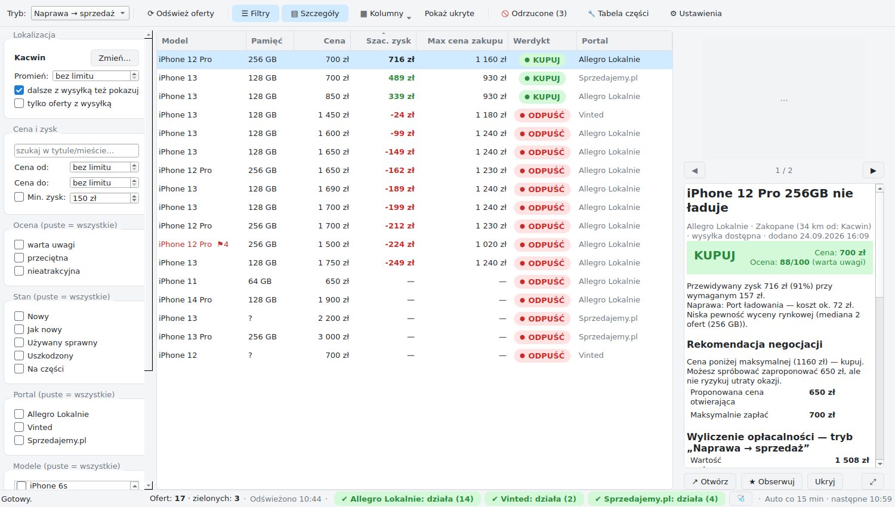
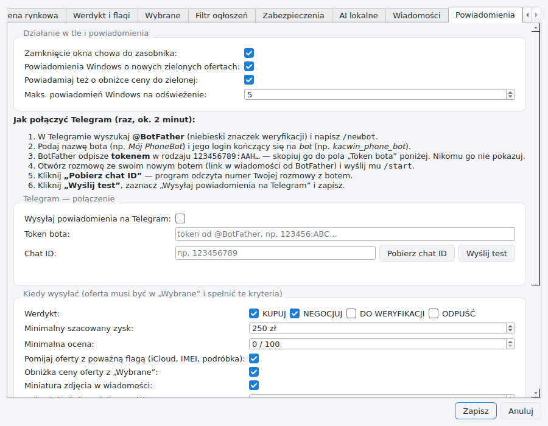
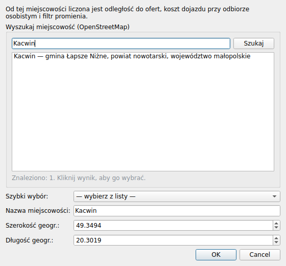
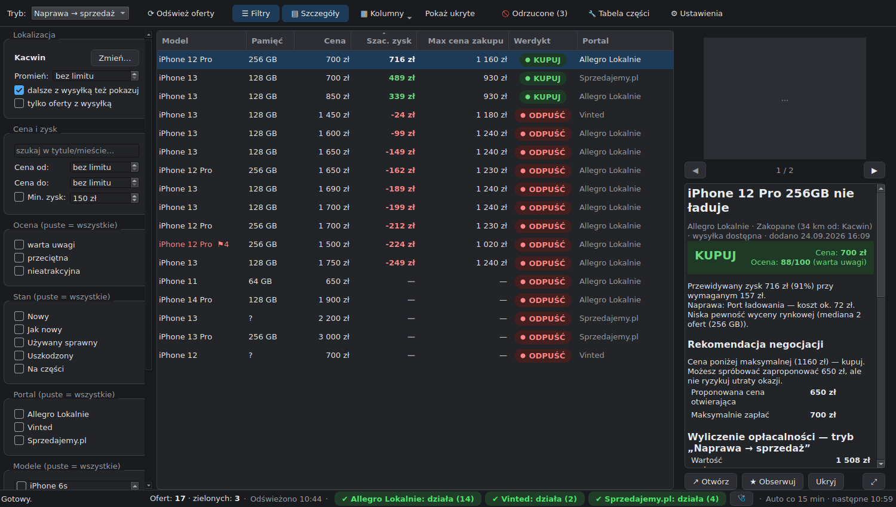

# PhoneBot — wyszukiwarka opłacalnych ofert iPhone'ów

Aplikacja desktopowa (Windows) do wyszukiwania ofert używanych iPhone'ów na
Allegro Lokalnie, Vinted i Sprzedajemy.pl, wyceny ich opłacalności i podpowiadania, czy i za ile kupić.

> **Status: wersja 1.4.1.** Trzy portale, wycena, werdykty i negocjacje, filtry, zabezpieczenia werdyktu,
> **darmowe lokalne AI** (klasyfikator tytułów, analiza zdjęć, opcjonalnie model językowy w Ollamie),
> szablony wiadomości do sprzedającego, automatyczne odświeżanie, powiadomienia Windows i Telegram
> oraz gotowy plik `PhoneBot.exe`. Program nie korzysta z żadnych płatnych usług.




## Szybki start: gotowy plik PhoneBot.exe

1. Wejdź na GitHubie w zakładkę **Actions** → workflow **build-windows** → ostatni udany przebieg
   (zielony) → sekcja **Artifacts** → pobierz **PhoneBot-windows** (plik ZIP z `PhoneBot.exe`).
   Jeśli oznaczysz wersję tagiem `v…` (np. `v1.0.0`), plik trafi też do zakładki **Releases**.
2. Rozpakuj i uruchom `PhoneBot.exe`; nie wymaga instalowania Pythona.
   Windows SmartScreen może ostrzec o nieznanym wydawcy (plik nie jest podpisany cyfrowo).
   Kliknij wtedy „Więcej informacji” → „Uruchom mimo to”.
3. Przy pierwszym uruchomieniu:
   - sprawdź miejscowość w panelu filtrów (domyślnie Kacwin),
   - przejrzyj **⚙ Ustawienia** (zysk, prowizje) i **🔧 Tabelę części**,
   - kliknij **⟳ Odśwież oferty** (F5).
   - W tle program trenuje klasyfikator tytułów (kilka sekund) i **jednorazowo pobiera model zdjęć**
     (176 MB z Hugging Face). Postęp widać na pasku stanu („AI: …”). Potem działa bez internetu.

Pierwsze pobranie nie wysyła powiadomień, bo wszystkie oferty są wtedy „nowe”.
Powiadomienia przychodzą od kolejnych odświeżeń.

### Budowanie PhoneBot.exe samodzielnie

```powershell
pip install -r requirements.txt pyinstaller
pyinstaller --noconfirm phonebot.spec     # wynik: dist\PhoneBot.exe
dist\PhoneBot.exe --self-test             # moduły, lokalne AI (bez pobierania modelu) i okno
```

## Uruchomienie na Windows (tryb deweloperski)

1. Zainstaluj **Python 3.12** z [python.org](https://www.python.org/downloads/windows/)
   i zaznacz „Add python.exe to PATH”.
2. Otwórz PowerShell w folderze projektu i wykonaj:

   ```powershell
   py -3.12 -m venv .venv
   .\.venv\Scripts\Activate.ps1
   pip install -r requirements-dev.txt
   ```

   Jeśli PowerShell blokuje aktywację, wykonaj raz:
   `Set-ExecutionPolicy -Scope CurrentUser RemoteSigned`.
3. Uruchom aplikację: `python -m phonebot`.
   Kliknij **⟳ Odśwież oferty** (F5), aby pobrać ogłoszenia z portali.
4. Testy: `python -m pytest`.
5. Demo wyceny w konsoli: `python -m phonebot.demo`.

### Automatyczne odświeżanie i praca w tle

- Oferty są pobierane automatycznie co **15 minut**; zmienisz to w Ustawieniach, a wartość 0 wyłącza
  automat. Pasek stanu pokazuje godzinę następnego odświeżenia.
- Zamknięcie okna chowa aplikację do **zasobnika systemowego** (obok zegara) i odświeżanie działa dalej.
  Kliknij ikonę, aby wrócić. Całkowite zamknięcie: prawy przycisk na ikonie → „Zakończ”.
  To zachowanie wyłączysz w Ustawieniach.
- O nowych **zielonych** ofertach, a opcjonalnie także o obniżce ceny do zielonej, informuje
  **powiadomienie Windows**. Każda oferta jest zgłaszana tylko raz.

### Powiadomienia Telegram

1. W Telegramie otwórz **@BotFather**, wyślij `/newbot` i nadaj botowi nazwę. Dostaniesz **token**
   (np. `123456789:AAH…`).
2. Otwórz rozmowę ze swoim nowym botem i wyślij mu `/start`.
3. W PhoneBot: **⚙ Ustawienia → Powiadomienia**. Wklej token i kliknij **Pobierz chat ID**.
4. Kliknij **Wyślij test**. Na Telegramie powinna przyjść wiadomość.
5. Zaznacz „Wysyłaj powiadomienia na Telegram” i zapisz.



Każda wiadomość zawiera model, cenę, szacowany zysk, max cenę, sugestię negocjacji, lokalizację,
czerwone flagi i link do ogłoszenia. Na jedno odświeżenie wysyłanych jest maksymalnie 5 osobnych
wiadomości (do ustawienia), a resztę dostajesz w jednym podsumowaniu.

Token Telegrama jest przechowywany w lokalnej bazie aplikacji bez szyfrowania.

(Płatna analiza opisów przez Claude z wersji 1.0–1.3 została usunięta; zapisany klucz API znika z bazy
przy pierwszym uruchomieniu wersji 1.4. Zastępuje ją darmowa analiza lokalnym modelem — niżej.)

### Status źródeł i diagnostyka

Pod paskiem narzędzi widać status każdego portalu z ostatniego pobrania:

| Status | Znaczenie | Co zrobić |
|---|---|---|
| ✔ działa (N) | portal zwrócił N ofert | nic |
| ⚠ brak ofert | portal odpowiada, ale nic nie zwrócił | możliwa zmiana formatu — uruchom Diagnostykę |
| ⛔ zablokowane | portal blokuje automatyczne pobieranie (403, captcha) | automat robi pauzę 3 h (ręczne „Odśwież” ją pomija); jeśli trwa — wyłącz źródło |
| ✖ zmiana formatu | portal zmienił API lub stronę | adapter do aktualizacji — prześlij raport Diagnostyki |
| ✖ brak połączenia | brak internetu / zapora | sprawdź połączenie |

Najedź myszą na status, żeby zobaczyć szczegóły błędu. Przycisk **🩺 Diagnostyka**
sprawdza każdy portal osobno i pokazuje etap problemu (połączenie, blokada, parsowanie,
filtrowanie). Raport zapisuje się w `%LOCALAPPDATA%\PhoneBot\diagnostyka.txt`.
Ten sam raport wygenerujesz poleceniem `PhoneBot.exe --diagnose`.

Workflow **live-sources** w GitHub Actions codziennie sprawdza portale na żywo i oznacza
przebieg na czerwono, gdy któryś adapter przestanie zwracać oferty.

### Twoja miejscowość

Domyślnie ustawiony jest Kacwin. Zmienisz go w panelu filtrów („Lokalizacja → Zmień…”)
albo w ustawieniach. Miejscowość możesz wybrać na trzy sposoby:

- wpisać jej nazwę i kliknąć „Szukaj” (OpenStreetMap znajdzie dowolną miejscowość w Polsce),
- wybrać z wbudowanej listy (Podhale i większe miasta; działa bez internetu),
- wpisać współrzędne ręcznie.

Od wybranej miejscowości liczone są odległości do ofert, koszt dojazdu przy odbiorze osobistym
i filtr promienia.



### Filtr ogłoszeń i „Odrzucone”

Zanim oferta trafi do tabeli, przechodzi przez kilka etapów:

1. **Kategoria portalu** — szukanie odbywa się w kategorii telefonów (po ID kategorii, patrz niżej);
   gdy portal podaje kategorię oferty, „Akcesoria GSM” odpada.
2. **„Kupię / zamienię / szukam”** na początku tytułu → odrzucone („Sprzedam lub zamienię” przechodzi).
3. **Kilka generacji w tytule** — „13 14 15”, „12/13/14”, „iPhone 7 8 SE” to prawie zawsze etui lub szkło.
   Pojemność („128 GB”), bateria („85%”), okres („11 miesięcy”), ocena („8/10”) i wersja iOS nie są liczone.
4. **Akcesoria i części z kontekstem** — „Etui do iPhone 13” odpada, ale „iPhone 13 128GB + etui gratis”
   czy „iPhone 12 z pudełkiem i ładowarką” przechodzą. Lista słów obejmuje języki sąsiednie
   (czeski/słowacki: *obal, kryt, pouzdro*; niemiecki: *Hülle, Panzerglas*; litewski: *dėklas*;
   angielski: *case, cover, screen protector*; także francuski/hiszpański/włoski).
5. **Model** — ogłoszenie bez rozpoznanego modelu iPhone'a odpada.
6. **Kraj (Vinted)** — domyślnie widać też oferty z zagranicy (z flagą), patrz „Oferty z zagranicy” niżej.
7. **Sprzedawca seryjny** — patrz niżej.
8. **Test ceny** — cena poniżej 15% mediany rynkowej: jeśli opis wskazuje na akcesorium/atrapę,
   oferta odpada; w przeciwnym razie zostaje z czerwoną flagą „Cena nierealnie niska — sprawdź”.

Odrzucone ogłoszenia z powodem znajdziesz pod przyciskiem **🚫 Odrzucone** na pasku narzędzi.
Przycisk **„✔ To jest telefon”** przywraca ofertę do tabeli i zapamiętuje ją, więc filtr nie odrzuci
jej ponownie. Listy słów (akcesoria, części, „kupię”, słowa dodatków itd.) oraz próg ceny edytujesz
w **Ustawienia → Filtr ogłoszeń**; zakładka podpowiada też słowa, które najczęściej dawały
fałszywe odrzucenia. Po zmianie reguł (także po aktualizacji programu) oferty zapisane wcześniej
są sprawdzane ponownie — to, co nie przejdzie, trafia do „Odrzucone” (obserwowanych nie rusza).

### Zabezpieczenia werdyktu i „DO WERYFIKACJI”

Nowy werdykt **DO WERYFIKACJI** (szara etykieta) oznacza: „wygląda na okazję, ale coś się nie zgadza —
najpierw sprawdź ogłoszenie”. Taka oferta nigdy nie jest zielona i nie wywołuje powiadomienia.
Wszystkie progi są w **Ustawienia → Zabezpieczenia**:

| Reguła | Domyślnie | Skutek |
|---|---|---|
| Cena poniżej % wartości rynkowej (sprawny) | 30% | najwyżej DO WERYFIKACJI |
| Cena poniżej % wartości rynkowej (uszkodzony / na części) | 15% | najwyżej DO WERYFIKACJI |
| Zysk powyżej % zainwestowanej kwoty | 150% | najwyżej DO WERYFIKACJI |
| Nieznana pamięć (wycena z mediany wszystkich pojemności) | włączone | najwyżej DO WERYFIKACJI |
| Flaga ostrzegawcza (brak zdjęć, simlock, niesprawdzony…) | — | najwyżej NEGOCJUJ |
| Poważna flaga (iCloud, IMEI, MDM, podróbka) | — | najwyżej DO WERYFIKACJI |

Uszkodzone telefony mają niższy próg ceny, bo tani uszkodzony iPhone to normalna okazja do naprawy.
W szczegółach oferty widać, który powód obniżył werdykt („Werdykt obniżony z KUPUJ na …”).

**Czysta wycena rynkowa.** Oferty bez rozpoznanej pamięci nie są już danymi rynkowymi (to najczęściej
akcesoria), ceny poniżej 30% mediany są pomijane, a oferty z flagą „cena nierealnie niska” nie wchodzą
do mediany. Wcześniej tanie etui zapisane jako „iPhone 13” obniżały wycenę prawdziwych telefonów.

### Oferty z zagranicy (Vinted)

Vinted pokazuje też ogłoszenia z innych krajów (np. z Czech, Słowacji, Niemiec) z wysyłką do Polski.
W Ustawieniach → Zabezpieczenia → „Oferty z Vinted” wybierasz:

- **Z Polski i z zagranicy** (domyślnie od wersji 1.4.1) — oferty zagraniczne są na liście z flagą
  „Sprzedawca z zagranicy” (kolumna „Flagi” i panel szczegółów). Flaga jest „łagodna”: najwyższy werdykt
  to NEGOCJUJ (limit „przy łagodnej fladze” w Zabezpieczeniach), a w pytaniach do sprzedającego jest
  pytanie o wysyłkę do Polski i jej koszt;
- **Tylko oferty z Polski** — odpada tytuł w obcym języku (np. „obal”, „prodám”, „Hülle”) oraz oferta
  sprzedawcy, którego profil podaje inny kraj niż Polska.

Po aktualizacji do 1.4.1 zapisane ustawienie „tylko z Polski” zmienia się raz na „z Polski i z zagranicy”,
a oferty odrzucone wcześniej za kraj (zakładka „Odrzucone”) wracają na listę — o ile przechodzą pozostałe
reguły (filtr tekstu, sprzedawcy seryjni, test ceny). Wrócić do „tylko z Polski” możesz w każdej chwili.

Wyniki wyszukiwania Vinted nie zawierają kraju sprzedawcy, więc aplikacja sprawdza go w profilu
sprzedawcy — tylko dla ofert, które przeszły filtr tekstu i mają tytuł po polsku (obcy język już
rozstrzyga), najwyżej 20 sprzedawców na odświeżenie (ustawienie), z pamięcią na 30 dni. Pozostali
są sprawdzani przy kolejnych odświeżeniach.

Uwaga: Vinted podaje ceny w walucie kraju, z którego łączy się komputer — z Polski wszystkie ceny są
w złotych (także ofert zagranicznych). Ceny w innej walucie (np. z serwera testowego poza Polską) są pomijane.

### Sprzedawcy seryjni

Jeśli jeden sprzedawca ma co najmniej 3 oferty „iPhone'ów” w cenie poniżej 40% wartości rynkowej,
zostaje oznaczony, a wszystkie jego oferty trafiają do „Odrzucone” (etap „sprzedawca seryjny”) —
także te, które wystawi później. Pomyłkę cofniesz przyciskiem **„✔ Sprzedawca jest w porządku”**
w oknie „Odrzucone”. Wykrywanie działa tam, gdzie portal podaje identyfikator sprzedawcy (Vinted);
Allegro Lokalnie i Sprzedajemy.pl go nie udostępniają, a zgadywanie po samym tytule dawało fałszywe alarmy.

### Kategorie portali

| Portal | Kategoria | ID | Jak działa |
|---|---|---|---|
| Sprzedajemy.pl | Elektronika > Telefony > Telefony komórkowe > Apple iPhone | 1390 | szukanie w tej kategorii; aplikacja sprawdza ID kategorii w odpowiedzi |
| Allegro Lokalnie | Telefony i akcesoria | 4 | portal nie ma osobnej kategorii samych telefonów — akcesoria odsiewa filtr tekstu |
| Vinted | Telefony komórkowe | 3661 | **API Vinted ignoruje filtr kategorii** (sprawdzone 5 wariantami parametru), dlatego tanie akcesoria odcina minimalna cena pobierania (domyślnie 150 zł) |

ID, adresy kategorii i minimalne ceny edytujesz w **Ustawienia → Zabezpieczenia**.

### Lokalne AI (darmowe, na Twoim komputerze)

Reguły z poprzedniego punktu decydują, co trafia do tabeli. Dwie warstwy AI mogą to **potwierdzić
albo podważyć**. Wszystko działa lokalnie, na procesorze, bez płatnych usług i bez wysyłania danych.
Internet jest potrzebny tylko do jednorazowego pobrania modelu zdjęć i do pobrania zdjęcia oferty
(z tego samego serwera co miniatury).

**1. Klasyfikator tytułów** (scikit-learn: TF-IDF na fragmentach słów + regresja logistyczna) rozpoznaje
4 klasy: telefon / akcesorium / część / kupię. Odporny na literówki i obce języki (obal, kryt, Hülle, dėklas…).
Uczy się na:

- zbiorze startowym — 783 tytuły po polsku i w językach sąsiednich (działa od pierwszego uruchomienia),
- ofertach odrzuconych przez reguły (etap → klasa),
- Twoich oznaczeniach: **„✖ To nie jest telefon”** w panelu szczegółów (oferta idzie do „Odrzucone”)
  i „To jest telefon” w oknie „Odrzucone” — te ważą najwięcej,
- ofertach ukrytych ręcznie, jako słaba wskazówka. Ukrytą ofertę, którą model i tak uważa za telefon,
  pomija, bo mogła zostać ukryta np. przez cenę. Można to wyłączyć.

Skuteczność (widoczna w **Ustawienia → AI lokalne**, liczona przy każdym treningu):
**97%** na 20% danych odłożonych przed treningiem i **98% (54/55)** na zestawie kontrolnym prawdziwych
tytułów z portali, których model nigdy nie widzi. Przycisk **„🎓 Douczyć model”** uczy go od nowa
(kilka sekund, w tle). Automatycznie douczy się po 50 nowych oznaczeniach (ustawienie) albo po 500 nowych
ofertach odrzuconych przez reguły.

**2. Analiza zdjęcia** (CLIP ViT-B/32 w onnxruntime, bez karty graficznej): główne zdjęcie oferty
jest porównywane z opisami „smartfon”, „etui”, „szkło ochronne”, „pudełko”. Model (176 MB) pobiera się raz,
z przypiętej wersji pliku na Hugging Face i z kontrolą sumy SHA-256. Analizowane są tylko oferty z werdyktem KUPUJ, NEGOCJUJ lub DO WERYFIKACJI —
najlepsze najpierw, **każda raz** (wynik, także błąd pobrania, zostaje w bazie). Zdjęcia z jednego serwera
pobierane są nie częściej niż co 1 s. Analiza jednego zdjęcia trwa ok. **70 ms** (zmierzone kodem programu
na 2 rdzeniach w GitHub Actions, Linux i Windows) — dłużej trwa samo, celowo powolne, pobieranie zdjęć.

Sprawdzone kodem programu na 80 prawdziwych zdjęciach z Vinted (po 20 każdego rodzaju) — uczciwie
o ograniczeniach:

| Co na zdjęciu | Rozpoznane | Obniża werdykt (pewność ≥ 80%) |
|---|---|---|
| telefon | 10/20 jako „smartfon” | **0/20** — żadnego fałszywego alarmu |
| etui | 19/20 | 19/20 |
| szkło ochronne | 15/20 | 11/20 |
| puste pudełko | **0/20** — na pudełku jest zdjęcie telefonu | 1/20 |

Dlatego zdjęcie jest warstwą dodatkową: niepewne zdjęcie nie obniża werdyktu, gdy tytuł potwierdza telefon,
a puste pudełka łapią klasyfikator tytułów i reguły. Sprawdzenie można powtórzyć: workflow **clip-check**
w zakładce Actions.

**Łączenie warstw** (panel szczegółów → „Ocena warstw”, każda warstwa z pewnością):

| Sytuacja | Skutek |
|---|---|
| tytuł albo zdjęcie potwierdza telefon, żadna warstwa nie przeczy | bez zmian |
| tytuł wygląda na akcesorium / część / „kupię” (≥ 60%) | najwyżej **DO WERYFIKACJI** |
| zdjęcie pokazuje etui / szkło / pudełko (≥ 80%) | najwyżej **DO WERYFIKACJI** |
| ani tytuł, ani zdjęcie nie potwierdza telefonu (niska pewność) | najwyżej **DO WERYFIKACJI** |
| brak wyników AI (np. analiza wyłączona) | decydują same reguły |

AI nigdy samo nie odrzuca oferty — tylko ogranicza werdykt i opisuje powód. Progi, włączanie warstw
i douczanie: **Ustawienia → AI lokalne**.

Zasoby: model zdjęć zajmuje ok. **450 MB RAM** przez cały czas działania programu (wczytywany raz, przy
starcie), analiza używa połowy rdzeni procesora, żeby okno działało płynnie. Klasyfikator tytułów to kilka MB
i ok. 3 s treningu. Karta graficzna nie jest potrzebna. Plik `PhoneBot.exe` ma teraz ok. 123 MB
(wcześniej ok. 60 MB) — doszły scikit-learn i onnxruntime.

### Analiza opisów lokalnym modelem językowym (Ollama, opcjonalna)

Oferty **DO WERYFIKACJI** (coś się nie zgadza) może przeczytać model językowy działający na Twojej
karcie graficznej. Wyciąga z opisu: **pamięć, kondycję baterii, usterki, blokady (iCloud, simlock, MDM),
„na części”** i czy to w ogóle telefon. Działa za darmo, bez internetu (poza pobraniem modelu) i bez
wysyłania danych. Bez Ollamy program działa normalnie — domyślnie ta funkcja jest wyłączona.

**Wymagania** (Twój komputer: 16 GB RAM, RTX 3060 Ti 8 GB — spełnia z zapasem):

| | Minimum | Polecane |
|---|---|---|
| Karta graficzna | NVIDIA z 6 GB pamięci | 8 GB (np. RTX 3060 Ti) |
| Pamięć RAM | 16 GB | 16 GB |
| Dysk | ok. 6 GB na model | SSD |
| Czas na jeden opis | — | ok. 2–6 s (bez karty graficznej: kilkadziesiąt sekund) |

**Model:** `qwen3:8b` (ok. 5,2 GB, domyślny) — najlepszy w tej wielkości do wyciągania danych
w ustalonym formacie, dobrze rozumie polski. Lżejsza alternatywa: `qwen2.5:7b` (4,7 GB). Modele 12–14B
i większe nie mieszczą się w 8 GB pamięci karty i działają kilka razy wolniej. Ollama zwalnia kartę
graficzną po 5 minutach bezczynności.

**Sprawdzone na prawdziwej Ollamie** (workflow **ollama-check**: kod programu, `qwen3:8b`, 16 opisów
z pułapkami — zaprzeczenia „ekran cały”, „Face ID działa”, „bez blokad”, ogłoszenia „kupię”/„zamienię”,
samo etui i pudełko): **95% zgodności pól** (41 z 43). Pierwsza wersja promptu miała 79% — model dopisywał
usterki mimo zaprzeczeń; stąd zasada cytatów (niżej). Tryb „myślenia” Qwen3 dał 93% przy ok. 5× dłuższym
czasie, więc jest domyślnie wyłączony (można go włączyć w ustawieniach). Na procesorze serwera testowego
opis trwał ok. 25 s; na karcie graficznej — kilka sekund.

**Uruchomienie:**

1. Zainstaluj darmową Ollamę: <https://ollama.com/download> (Windows). Działa w tle, pod adresem
   `http://127.0.0.1:11434`.
2. **⚙ Ustawienia → AI lokalne → „Analiza opisów”**: kliknij **Sprawdź połączenie**, a potem
   **⬇ Pobierz model** (raz, ok. 5 GB; można też w terminalu: `ollama pull qwen3:8b`).
3. Zaznacz „Czytaj opisy ofert „DO WERYFIKACJI” lokalnym modelem” i zapisz.

**Jak to działa:**

- Czytane są tylko oferty DO WERYFIKACJI (najlepsze najpierw), każdy opis **raz** — ponownie dopiero,
  gdy sprzedawca go zmieni. Postęp widać na pasku stanu („AI: czytanie opisów 3/12 (Ollama)…”).
- Program **sprawdza każdą odpowiedź modelu**: pamięć i kondycję baterii przyjmuje tylko wtedy, gdy ta
  liczba naprawdę występuje w ogłoszeniu (a pamięć pasuje do modelu iPhone'a), „na części” — tylko gdy
  ogłoszenie tak mówi. Przy każdej usterce i fladze model musi podać **cytat z ogłoszenia**; program
  odrzuca cytat, którego w ogłoszeniu nie ma, zaprzeczenie („ekran cały”, „bez blokad”) i cytat niepasujący
  do flagi. Usterki i flagi AI może dodać, nigdy nie usuwa wyniku reguł.
- Wynik wpływa na wycenę: np. pamięć znaleziona w opisie usuwa flagę „Nieznana pamięć” i werdykt może
  wrócić do KUPUJ/NEGOCJUJ; blokada iCloud z opisu obniża werdykt; „to nie telefon” → DO WERYFIKACJI.
  W panelu szczegółów: warstwa **„Opis (Ollama)”** w „Ocenie warstw” i dopiski **„(AI z opisu)”**.
- **Opis ze strony oferty:** Vinted i Sprzedajemy.pl (a często też Allegro Lokalnie) nie podają opisu
  w wynikach wyszukiwania. Program pobiera wtedy stronę oferty — tylko ofert DO WERYFIKACJI, każdą raz,
  w tym samym limicie zapytań co wyszukiwanie (1 zapytanie na 4 s na portal). Z Vinted czyta tylko początek
  strony (ok. 160 kB z 2 MB), bo tam jest opis. Sprawdzone we wrześniu 2026: wszystkie trzy portale
  udostępniają opis na stronie oferty; API przedmiotu Vinted jest chronione przed automatami (403), więc
  nie jest używane. Jeśli portal zablokuje pobieranie strony, program **przestaje pobierać** opisy z tego
  portalu do końca działania (bez prób obchodzenia zabezpieczeń). Można to wyłączyć w ustawieniach.

### Wiadomości do sprzedającego

Przycisk **„📋 Skopiuj wiadomość”** w panelu szczegółów kopiuje do schowka gotową wiadomość z danymi oferty
— wklejasz ją w portalu i wysyłasz sam. Szablon wybierany jest według werdyktu, strzałka przy przycisku
pozwala wybrać inny:

- **Kupuję (KUPUJ)** — pytanie o dostępność i prośba o wysyłkę,
- **Negocjacja ceny (NEGOCJUJ)** — Twoja cena otwierająca (zaokrąglona do 10 zł) i rzeczowe argumenty:
  usterki z kosztem naprawy z tabeli części, słaba bateria, niższe ceny podobnych ofert (tylko gdy są niższe),
- **Pytania przed zakupem (DO WERYFIKACJI)** — pytania dopasowane do oferty: pamięć, bateria, blokada iCloud,
  działanie funkcji, naprawy, oryginalność przy podejrzanie niskiej cenie, wysyłka z zagranicy.

Szablony edytujesz w **⚙ Ustawienia → Wiadomości** (pola: `{telefon}`, `{model}`, `{pamiec}`, `{cena}`,
`{propozycja}`, `{argumenty}`, `{pytania}`, `{wysylka}`); „Przywróć domyślne szablony” cofa zmiany.

### Okno główne

Układ: **filtry po lewej, tabela ofert w środku, szczegóły zaznaczonej oferty po prawej**,
pasek statusu na dole. Panele włączasz i wyłączasz przyciskami „☰ Filtry” (Ctrl+F)
i „▤ Szczegóły” (Ctrl+D). Ich szerokość zmienisz, przeciągając krawędź. Układ jest zapamiętywany.

- **Kolumny domyślne:** model, pamięć, cena, szacowany zysk, max cena zakupu, werdykt, portal.
  Pozostałe (zdjęcie, stan, bateria, wartość rynkowa, ocena, czerwone flagi, lokalizacja, data dodania,
  link) włączasz w menu **„▦ Kolumny”** albo prawym przyciskiem na nagłówku. Kolumny można przeciągać
  i poszerzać; „Przywróć domyślne kolumny” cofa zmiany. Nagłówek jest zawsze widoczny przy przewijaniu.
- Każdą kolumnę można sortować kliknięciem nagłówka. Domyślnie tabela jest posortowana
  po szacowanym zysku, malejąco.
- **Werdykt** to kolorowa etykieta z tekstem: 🟢 KUPUJ, 🟡 NEGOCJUJ, ⚪ DO WERYFIKACJI, 🔴 ODPUŚĆ.
  Ocena 0–100 jest w podpowiedzi i w kolumnie „Ocena”. Tło wierszy jest neutralne,
  a oferty obserwowane są lekko wyróżnione.
- Ceny mają format „1 250 zł” i są wyrównane do prawej. **Zysk dodatni jest zielony, ujemny czerwony.**
- Oznaczenia przy modelu:
  - **⚑N** — liczba czerwonych flag; najedź myszą, aby zobaczyć listę. Przy poważnej fladze
    (iCloud, IMEI, MDM, podróbka) nazwa modelu jest czerwona;
  - **★** — oferta obserwowana.
- **Panel szczegółów** pokazuje zaznaczoną ofertę od razu po kliknięciu:
  - zdjęcia,
  - werdykt z uzasadnieniem,
  - rekomendację negocjacji (cena otwierająca i maksymalna),
  - pełne wyliczenie: wartość rynkową i jej źródło, każdą pozycję kosztów, zysk, wymagany zysk i max cenę,
  - czerwone flagi z karą punktową,
  - dane rozpoznane z ogłoszenia, historię ceny i opis.

  Przyciski: „↗ Otwórz”, „★ Obserwuj”, „Ukryj”. **Podwójne kliknięcie**, Enter albo „⤢”
  otwiera to samo w dużym oknie.
- **Pasek statusu** (na dole): liczba ofert (widoczne po filtrach / wszystkie, w tym zielone),
  godzina ostatniego odświeżenia, status każdego portalu (najedź myszą, aby zobaczyć błąd i podpowiedź),
  przycisk diagnostyki 🩺 i czas następnego automatycznego odświeżenia.
- **Motyw jasny / ciemny / systemowy** i rozmiar czcionki ustawisz w
  „⚙ Ustawienia → Ogólne i pobieranie → Wygląd”. Zmiana działa od razu, bez restartu.
- Kliknięcie „Otwórz ↗” w kolumnie „Link” od razu otwiera ogłoszenie w przeglądarce.



- **Prawy przycisk myszy** na wierszu otwiera menu: szczegóły, otwórz, obserwuj, ukryj.
  Ukryte oferty znikają z listy. Przycisk „Pokaż ukryte” pozwala je przywrócić.
- Przełącznik trybu (Naprawa → sprzedaż / Szybki resell) od razu przelicza wyceny.
- Pobieranie działa w osobnym wątku, więc okno nie zawiesza się w trakcie.
  Błąd portalu widać w pasku statusu; szczegóły są w podpowiedzi po najechaniu myszą
  i w logu `%LOCALAPPDATA%\PhoneBot\logs\phonebot.log`.
- **Panel filtrów** po lewej działa natychmiast, bez ponownego pobierania ofert,
  i zapamiętuje ustawienia. Możesz filtrować po:
  - lokalizacji i promieniu (oferty z wysyłką mogą zostać mimo odległości),
  - „tylko z wysyłką”,
  - tekście,
  - cenie od–do,
  - minimalnym zysku,
  - ocenie (zielone / żółte / czerwone),
  - stanie,
  - portalu,
  - modelach.
- **⚙ Ustawienia**: wszystkie progi i koszty, edytowalne bez zmian w kodzie:
  - portale i tempo pobierania,
  - minimalny zysk dla każdego trybu,
  - kanały sprzedaży i prowizje,
  - koszty zakupu i naprawy,
  - opłaty kupującego (np. ochrona kupujących na Vinted),
  - parametry wyceny rynkowej i ręczne wartości rynkowe,
  - progi werdyktu i kolorów,
  - kary za flagi.
- **🔧 Tabela części**: ceny części dla każdego modelu (wiersz „*” to cena domyślna),
  z filtrem po modelu. Możesz dodawać i usuwać pozycje.
- Pobierane są frazy „iphone”, w trybie naprawy dodatkowo „iphone uszkodzony / zbity / na części”,
  oraz frazy dopisane w ustawieniach. Z każdej frazy pobierane są maksymalnie 3 strony wyników. Aplikacja pomija:
  - akcesoria i pojedyncze części (etui, szkła, wyświetlacze…),
  - ogłoszenia „kupię / skup / zamienię”,
  - oferty z nierozpoznanym modelem

  (szczegóły w sekcji „Filtr ogłoszeń i »Odrzucone«”).
- Ceny wszystkich zebranych ofert zasilają bazę do liczenia wartości rynkowej.
  Im dłużej aplikacja działa, tym dokładniejsze są wyceny.

Gotowy plik `PhoneBot.exe` (bez instalowania Pythona) pojawi się w etapie 5.

Dane aplikacji (baza SQLite, logi, miniatury) trafiają do `%LOCALAPPDATA%\PhoneBot`.
Inne miejsce ustawisz zmienną środowiskową `PHONEBOT_HOME`.

## Jak działa wycena

Każde ogłoszenie przechodzi przez następujące kroki:

1. **Normalizacja** (`core/normalizer.py`): z tytułu, opisu i parametrów portalu
   wyciągane są model, pojemność, stan, kondycja baterii, gotowość do negocjacji
   i lista usterek. Rozpoznawanie uwzględnia zaprzeczenia: „ekran nie zbity” czy
   „bez blokad iCloud” nie są traktowane jak usterki ani flagi.
2. **Czerwone flagi** (`core/red_flags.py`): blokada iCloud, zablokowany IMEI,
   MDM, podróbka, simlock, brak zasięgu, zamienniki, „na części” bez opisu,
   brak zdjęć, podejrzanie niska cena i nieznany koszt naprawy. Flagi obniżają
   ocenę (kary można edytować), ale domyślnie nie zmieniają werdyktu.
3. **Wartość rynkowa V** (`core/market.py`): mediana cen porównywalnych ofert
   (ten sam model, pojemność i klasa stanu) z ostatnich 30 dni, po odrzuceniu
   wartości odstających (IQR). Wynik jest mnożony przez korektę 0,90, bo ceny
   wywoławcze są wyższe od transakcyjnych. Gdy danych brakuje, stosowana jest
   kolejno: mediana z mniejszej próby, mediana innych pojemności (przeliczona)
   albo wartość wpisana ręcznie w ustawieniach.
4. **Koszty i zysk** (`core/valuation.py`):
   - naprawa R = części z edytowalnej tabeli + wysyłka części + własna robocizna
     (usterka o nieznanym koszcie, np. „nie włącza się”, liczy się jako ryzyko 200 zł),
   - dostarczenie Sb = wysyłka albo dojazd (odległość × 2 × stawka za km),
   - sprzedaż Cs = prowizja wybranego kanału + opłata stała + wysyłka + pakowanie,
   - **zysk = V − cena − R − Sb − Cs**.
5. **Maksymalna cena zakupu** to najwyższa cena, przy której zysk jest nie
   mniejszy niż wymagany: kwota (np. 150 zł) i/lub procent od zainwestowanej
   kwoty (np. 20%). Tryb łączenia tych progów ustawisz w opcjach.
6. **Werdykt i negocjacje** (`core/negotiation.py`):
   - **KUPUJ**: cena ≤ max. Dostajesz sugestię delikatnej propozycji niższej ceny.
   - **NEGOCJUJ**: cena do 15% powyżej max (do 25%, gdy w ogłoszeniu jest
     „do negocjacji”). Dostajesz cenę otwierającą i maksymalną.
   - **ODPUŚĆ**: w pozostałych przypadkach, a także przy „cenie ostatecznej” powyżej max.
7. **Ocena 0–100 i kolor**: ocena uwzględnia atrakcyjność ceny, pewność
   wyceny rynkowej i kary za flagi. Kolor zielony oznacza ≥ 65 pkt, żółty ≥ 40 pkt,
   czerwony poniżej 40 pkt.

W trybie **„Szybki resell”** telefony z usterkami wymagającymi naprawy dostają
ODPUŚĆ. Słaba bateria i drobne wgniecenia nie dyskwalifikują oferty.

### Wartości domyślne do weryfikacji

Ceny części (`core/parts.py`) i prowizje portali (`core/settings.py`) to
**wartości orientacyjne**. Po uruchomieniu GUI można je edytować w aplikacji.
Sprawdź zwłaszcza:

- ceny części u swojego dostawcy,
- aktualny cennik OLX, jeśli tam sprzedajesz (opłaty za ogłoszenia w kategorii Telefony),
- prowizję Allegro dla smartfonów (domyślnie 8% + 1 zł).

## Struktura projektu

```
phonebot/
  core/          logika domenowa (bez GUI i sieci) — w pełni testowana
    models.py        modele: oferta, stan, usterki, flagi, wynik wyceny
    text.py          normalizacja tekstu i dopasowanie fraz z zaprzeczeniami
    catalog.py       katalog modeli iPhone i pojemności
    normalizer.py    model / pojemność / stan / usterki / bateria / negocjacje
    red_flags.py     czerwone flagi
    market.py        wartość rynkowa (mediana, IQR, fallbacki)
    parts.py         domyślna tabela cen części
    valuation.py     koszty, zysk, max cena zakupu
    negotiation.py   werdykt, negocjacje, ocena i kolor
    settings.py      wszystkie ustawienia (JSON w bazie)
    geo.py           odległości
  storage/       SQLite: schemat z migracjami, repozytoria
  core/listing_filter.py  wieloetapowy filtr: akcesoria, części, „kupię”, kilka generacji, test ceny
  core/sanity.py  zabezpieczenia werdyktu (DO WERYFIKACJI, limity przy flagach)
  core/language.py  rozpoznawanie języka tytułu (oferty z zagranicy na Vinted)
  services/offer_guard.py  reguły odrzucania w jednym miejscu (kraj, sprzedawcy seryjni, ponowne filtrowanie)
  ml/            lokalne AI: seed_data.py (zbiór startowy), text_model.py (klasyfikator tytułów),
                 photo_model.py (CLIP w onnxruntime), ollama.py (klient Ollamy), desc_model.py (czytanie
                 opisów + sprawdzanie odpowiedzi), combine.py (łączenie warstw), selftest.py
  core/messages.py  szablony wiadomości do sprzedającego;  sources/pages.py  opis ze strony oferty
  services/ai_service.py  dane do nauki z bazy, douczanie, analiza zdjęć;  ui/ai_worker.py  wątek AI
  net/http.py    klient HTTP: limit zapytań na host, ponawianie (tenacity), cache odpowiedzi
  services/      evaluator.py (baza + wycena), scanner.py (równoległe pobieranie z izolacją błędów),
                 post_scan.py (powiadomienia po skanie),
                 notifications.py (Telegram)
  core/view_filter.py  filtry widoku;  core/places.py  wbudowana lista miejscowości
  net/geocode.py wyszukiwanie miejscowości (OpenStreetMap Nominatim)
  sources/       adaptery portali: base.py (interfejs), allegro_lokalnie.py, vinted.py, sprzedajemy.py,
                 extract.py (odporne wyciąganie ofert z JSON osadzonego w stronach)
  ui/            GUI PySide6: main_window.py, table_model.py, offer_details.py (+ details_html.py),
                 images.py (miniatury), workers.py (wątek), theme.py (kolory), filters_panel.py,
                 settings_dialog.py, parts_editor.py, location_dialog.py
tests/           testy jednostkowe (+ fixtures z przykładowymi odpowiedziami portali)
tools/           screenshot.py — zrzut okna na danych testowych
scripts/         clip_prepare.py (wektory opisów klas CLIP), clip_check_app.py (test analizy zdjęć na
                 prawdziwym modelu) — uruchamiane w GitHub Actions
phonebot.spec    konfiguracja PyInstaller (PhoneBot.exe); run_phonebot.py — punkt wejścia
assets/          ikona aplikacji
```

Aby dodać kolejny portal, utwórz plik w `sources/` z klasą dziedziczącą po
`SourceAdapter` (metoda `search`) i oznacz ją dekoratorem `@register`.
Awaria jednego adaptera jest izolowana i nie zatrzymuje pozostałych.

## Plan etapów

1. ✅ Architektura, baza danych i logika wyceny z testami.
2. ✅ Pierwszy adapter i podstawowa tabela ofert w GUI (adapter OLX później usunięty, patrz niżej).
3. ✅ Kolorowanie, werdykty i rekomendacje negocjacji w GUI (okno szczegółów).
4. ✅ Allegro Lokalnie i Vinted, filtry, tryby, okno ustawień, wybór miejscowości i edytor tabeli części.
5. ✅ Automatyczne odświeżanie, zasobnik systemowy, powiadomienia Windows i Telegram oraz gotowy plik
   `PhoneBot.exe` budowany automatycznie przez GitHub Actions (płatna analiza opisów przez Claude — usunięta
   w wersji 1.4, zastąpiona lokalnym modelem).
6. ✅ Wieloetapowy filtr akcesoriów z widokiem „Odrzucone”, nowy układ okna (filtry | tabela | szczegóły),
   motyw jasny/ciemny i optymalizacja wydajności.
7. ✅ Zabezpieczenia regułowe: werdykt DO WERYFIKACJI, testy sensowności ceny i zysku, limity werdyktu
   przy flagach, kilka generacji w tytule, słowa w językach sąsiednich, kraj ofert Vinted, sprzedawcy
   seryjni, kategorie portali po ID, czysta wycena rynkowa.
8. ✅ Darmowe lokalne AI: klasyfikator tytułów (scikit-learn) z douczaniem na Twoich oznaczeniach,
   analiza zdjęć (CLIP), łączenie warstw z werdyktem, przycisk „To nie jest telefon”.
9. ✅ Opcjonalny lokalny model językowy (Ollama, qwen3:8b) czyta opisy ofert „DO WERYFIKACJI”
   (z opisem ze strony oferty, gdy wyniki go nie mają) oraz szablony wiadomości z przyciskiem
   „Skopiuj wiadomość”.

### Wydajność

Zmierzone na 5000 aktywnych ofert:

| Operacja | Czas |
|---|---|
| Otwarcie okna (wczytanie, wycena, tabela) | ok. 0,45 s |
| Sortowanie po dowolnej kolumnie | kilkadziesiąt ms |
| Zapis 3000 pobranych ofert (filtr + rozpoznanie + baza) | ok. 1,5 s (w tle) |

Baza nie rośnie bez końca: oferty nieaktywne dłużej niż 2 × okno wyceny (min. 60 dni) są usuwane,
z wyjątkiem obserwowanych. Nieużywane od 30 dni miniatury znikają z dysku, a zdjęcia w pamięci
mają limit.

## Uwaga o źródłach danych

Allegro Lokalnie nie ma API dla ogłoszeń, więc adapter czyta dane osadzone w stronie wyników
(JSON / JSON-LD). Wyszukuje w nich obiekty wyglądające jak oferta, zamiast polegać na sztywnej
ścieżce, dlatego drobne zmiany serwisu go nie psują. Jeśli serwis całkowicie zmieni wygląd,
aplikacja zgłosi błąd źródła („możliwa zmiana formatu serwisu”).
Allegro Lokalnie podaje tylko nazwę miasta. Odległość jest liczona, gdy to miasto jest
na wbudowanej liście miejscowości.

**OLX i Facebook Marketplace nie są obsługiwane.** OLX blokuje automatyczne pobieranie
(zapora CloudFront odpowiada „403 Request blocked” na API i stronę wyników), a jego oficjalne
Partner API służy tylko do zarządzania własnymi ogłoszeniami. Facebook Marketplace nie ma
publicznego API, a regulamin Meta zabrania automatycznego zbierania danych. Adapter OLX
został usunięty z projektu. Stare oferty z OLX znikają z listy przy aktualizacji bazy,
ale ich ceny nadal zasilają wycenę rynkową do końca okna czasowego (30 dni).
OLX pozostaje dostępny jako **kanał sprzedaży** w ustawieniach zysku, bo dotyczy Twojej
ręcznej sprzedaży, a nie pobierania ofert.

Vinted działa w trybie „best effort”. We wrześniu 2026 Vinted przeniósł katalog na
`api.vinted.pl/svc-catalogue/items` (stary adres zwraca 404) i adapter korzysta już z nowego. Adapter pobiera anonimowy token sesji
(ciasteczko `access_token_web`) i wysyła go do endpointu katalogu. Vinted często blokuje automaty; wtedy pasek stanu
pokaże błąd, a pozostałe portale działają normalnie. Katalog Vinted nie zawiera opisów ofert,
więc usterki rozpoznawane są tylko z tytułu. Do kosztu zakupu doliczana jest opłata za ochronę
kupujących: dokładna, jeśli podaje ją Vinted, w przeciwnym razie z ustawień (domyślnie 5% + 2,90 zł,
wartość orientacyjna).

Sprzedajemy.pl nie ma API. Strona wyników zawiera listę ofert w standardowym formacie JSON-LD,
którą czyta ten sam uniwersalny ekstraktor co Allegro Lokalnie. Miasto jest odczytywane z adresu
ogłoszenia. Pobierana jest pierwsza strona wyników na frazę, a ceny filtruje sama aplikacja.

Adaptery Allegro Lokalnie i Vinted są przetestowane na przykładowych danych w `tests/fixtures/`.
Pierwsze uruchomienie na prawdziwych portalach może wymagać dopasowania.

Żaden z trzech portali nie udostępnia publicznego API do wyszukiwania cudzych ogłoszeń.
Adaptery będą korzystać z danych, które strony same ładują w przeglądarce. Każdy adapter:

- ma limit zapytań (domyślnie jedno zapytanie na 4 s na portal),
- korzysta z cache,
- przy błędach ponawia próby z rosnącym opóźnieniem.

Analiza zdjęć przez lokalne AI pobiera **jedno** (główne) zdjęcie oferty, tylko dla ofert z werdyktem innym
niż ODPUŚĆ, każde tylko raz i nie częściej niż co 1 s z jednego serwera — to te same zdjęcia, które program
pokazuje jako miniatury.

Strony pojedynczych ofert (opis dla lokalnego modelu językowego) pobierane są tylko przy włączonej analizie
opisów, tylko dla ofert DO WERYFIKACJI, każda raz i w tym samym limicie zapytań co wyszukiwanie.

Automatyczne pobieranie może naruszać regulaminy portali. Używaj aplikacji
na własną odpowiedzialność, wyłącznie do użytku osobistego i z umiarkowaną
częstotliwością odświeżania.
