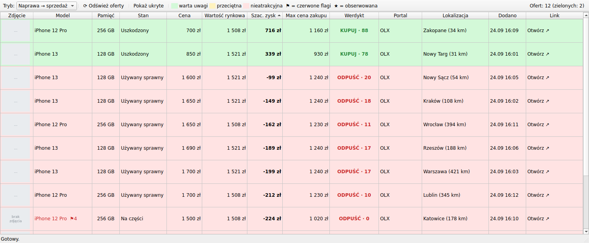
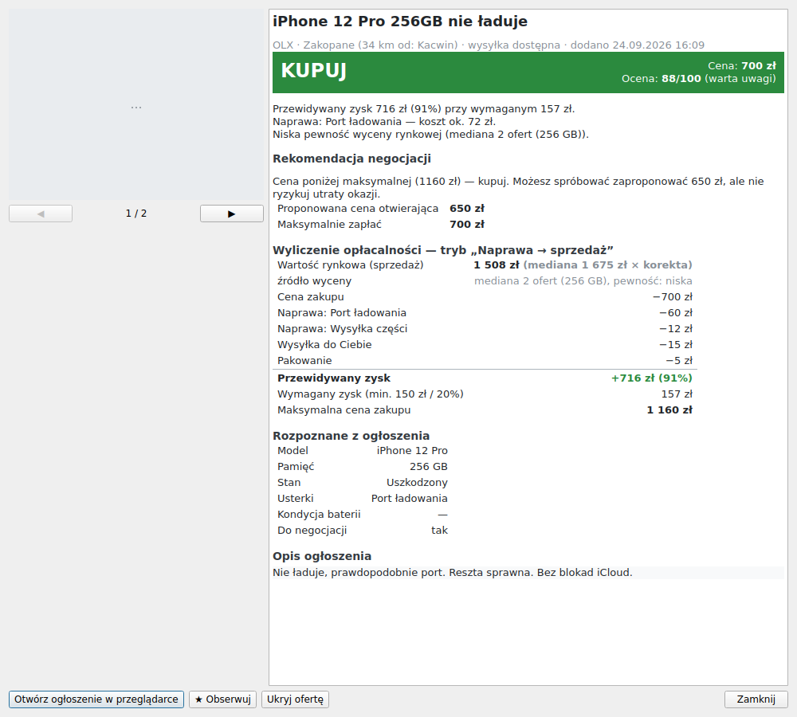

# PhoneBot — wyszukiwarka opłacalnych ofert iPhone'ów

Aplikacja desktopowa (Windows) do wyszukiwania ofert używanych iPhone'ów na OLX.pl,
Allegro Lokalnie i Vinted, wyceny ich opłacalności i podpowiadania, czy i za ile kupić.

> **Status: etap 3 z 5** — pobieranie z OLX, tabela z kolorami i werdyktami,
> okno szczegółów z pełnym wyliczeniem i negocjacjami. Kolejne etapy: patrz [Plan](#plan-etapów).




## Uruchomienie na Windows (tryb deweloperski)

1. Zainstaluj **Python 3.12** z [python.org](https://www.python.org/downloads/windows/)
   i zaznacz „Add python.exe to PATH”.
2. Otwórz PowerShell w folderze projektu i wykonaj:

   ```powershell
   py -3.12 -m venv .venv
   .\.venv\Scripts\Activate.ps1
   pip install -r requirements-dev.txt
   ```

   Jeśli PowerShell blokuje aktywację, wykonaj raz:
   `Set-ExecutionPolicy -Scope CurrentUser RemoteSigned`.
3. Uruchom aplikację: `python -m phonebot`.
   Kliknij **⟳ Odśwież oferty** (F5), aby pobrać ogłoszenia z OLX.
4. Testy: `python -m pytest`.
5. Demo wyceny w konsoli: `python -m phonebot.demo`.

### Okno główne

- Tabela ma kolumny: zdjęcie, model, pamięć, stan, cena, wartość rynkowa,
  szacowany zysk, max cena zakupu, werdykt, portal, lokalizacja (z odległością
  od Kacwina), data dodania i link.
- Każdą kolumnę można sortować kliknięciem nagłówka. Domyślnie tabela jest
  posortowana po szacowanym zysku, malejąco.
- Kolor wiersza zależy od oceny 0–100:
  - zielony (≥ 65 pkt) — oferta warta uwagi,
  - żółty (≥ 40 pkt) — przeciętna,
  - czerwony — nieatrakcyjna.

  Kolumna „Werdykt” pokazuje KUPUJ / NEGOCJUJ / ODPUŚĆ razem z oceną.
- Oznaczenia przy modelu:
  - **⚑N** — liczba czerwonych flag; najedź myszą, aby zobaczyć listę. Przy poważnej fladze
    (iCloud, IMEI, MDM, podróbka) nazwa modelu jest czerwona;
  - **★** — oferta obserwowana.
- **Podwójne kliknięcie** wiersza albo Enter otwiera okno szczegółów. Znajdziesz w nim:
  - zdjęcia oferty,
  - werdykt z uzasadnieniem,
  - rekomendację negocjacji (cena otwierająca i maksymalna),
  - pełne wyliczenie: wartość rynkową i jej źródło, każdą pozycję kosztów, zysk, wymagany zysk i max cenę,
  - czerwone flagi z karą punktową,
  - dane rozpoznane z ogłoszenia, historię ceny i opis ogłoszenia.

  Z tego okna możesz też otworzyć ogłoszenie w przeglądarce, obserwować je albo ukryć.
- Kliknięcie „Otwórz ↗” od razu otwiera ogłoszenie w przeglądarce.
- **Prawy przycisk myszy** na wierszu otwiera menu: szczegóły, otwórz, obserwuj, ukryj.
  Ukryte oferty znikają z listy. Przycisk „Pokaż ukryte” pozwala je przywrócić.
- Przełącznik trybu (Naprawa → sprzedaż / Szybki resell) od razu przelicza wyceny.
- Pobieranie działa w osobnym wątku, więc okno nie zawiesza się w trakcie.
  Błąd portalu widać w pasku stanu; szczegóły są w podpowiedzi po najechaniu myszą
  i w logu `%LOCALAPPDATA%\PhoneBot\logs\phonebot.log`.
- Pobierane są frazy „iphone” oraz w trybie naprawy „iphone uszkodzony / zbity / na części”,
  po 3 strony (po 40 ofert). Aplikacja pomija:
  - akcesoria i części (etui, szkła, wyświetlacze…),
  - ogłoszenia „kupię / skup / zamienię”,
  - oferty z nierozpoznanym modelem.
- Ceny wszystkich zebranych ofert zasilają bazę do liczenia wartości rynkowej.
  Im dłużej aplikacja działa, tym dokładniejsze są wyceny.

Gotowy plik `PhoneBot.exe` (bez instalowania Pythona) pojawi się w etapie 5.

Dane aplikacji (baza SQLite, logi, miniatury) trafiają do `%LOCALAPPDATA%\PhoneBot`.
Inne miejsce ustawisz zmienną środowiskową `PHONEBOT_HOME`.

## Jak działa wycena

Każde ogłoszenie przechodzi przez następujące kroki:

1. **Normalizacja** (`core/normalizer.py`): z tytułu, opisu i parametrów portalu
   wyciągane są model, pojemność, stan, kondycja baterii, gotowość do negocjacji
   i lista usterek. Rozpoznawanie uwzględnia zaprzeczenia: „ekran nie zbity” czy
   „bez blokad iCloud” nie są traktowane jak usterki ani flagi.
2. **Czerwone flagi** (`core/red_flags.py`): blokada iCloud, zablokowany IMEI,
   MDM, podróbka, simlock, brak zasięgu, zamienniki, „na części” bez opisu,
   brak zdjęć, podejrzanie niska cena i nieznany koszt naprawy. Flagi obniżają
   ocenę (kary można edytować), ale domyślnie nie zmieniają werdyktu.
3. **Wartość rynkowa V** (`core/market.py`): mediana cen porównywalnych ofert
   (ten sam model, pojemność i klasa stanu) z ostatnich 30 dni, po odrzuceniu
   wartości odstających (IQR). Wynik jest mnożony przez korektę 0,90, bo ceny
   wywoławcze są wyższe od transakcyjnych. Gdy danych brakuje, stosowana jest
   kolejno: mediana z mniejszej próby, mediana innych pojemności (przeliczona)
   albo wartość wpisana ręcznie w ustawieniach.
4. **Koszty i zysk** (`core/valuation.py`):
   - naprawa R = części z edytowalnej tabeli + wysyłka części + własna robocizna
     (usterka o nieznanym koszcie, np. „nie włącza się”, liczy się jako ryzyko 200 zł),
   - dostarczenie Sb = wysyłka albo dojazd (odległość × 2 × stawka za km),
   - sprzedaż Cs = prowizja wybranego kanału + opłata stała + wysyłka + pakowanie,
   - **zysk = V − cena − R − Sb − Cs**.
5. **Maksymalna cena zakupu** to najwyższa cena, przy której zysk jest nie
   mniejszy niż wymagany: kwota (np. 150 zł) i/lub procent od zainwestowanej
   kwoty (np. 20%). Tryb łączenia tych progów ustawisz w opcjach.
6. **Werdykt i negocjacje** (`core/negotiation.py`):
   - **KUPUJ**: cena ≤ max. Dostajesz sugestię delikatnej propozycji niższej ceny.
   - **NEGOCJUJ**: cena do 15% powyżej max (do 25%, gdy w ogłoszeniu jest
     „do negocjacji”). Dostajesz cenę otwierającą i maksymalną.
   - **ODPUŚĆ**: w pozostałych przypadkach, a także przy „cenie ostatecznej” powyżej max.
7. **Ocena 0–100 i kolor**: ocena uwzględnia atrakcyjność ceny, pewność
   wyceny rynkowej i kary za flagi. Kolor zielony oznacza ≥ 65 pkt, żółty ≥ 40 pkt,
   czerwony poniżej 40 pkt.

W trybie **„Szybki resell”** telefony z usterkami wymagającymi naprawy dostają
ODPUŚĆ. Słaba bateria i drobne wgniecenia nie dyskwalifikują oferty.

### Wartości domyślne do weryfikacji

Ceny części (`core/parts.py`) i prowizje portali (`core/settings.py`) to
**wartości orientacyjne**. Po uruchomieniu GUI można je edytować w aplikacji.
Sprawdź zwłaszcza:

- ceny części u swojego dostawcy,
- aktualny cennik OLX (opłaty za ogłoszenia w kategorii Telefony),
- prowizję Allegro dla smartfonów (domyślnie 8% + 1 zł).

## Struktura projektu

```
phonebot/
  core/          logika domenowa (bez GUI i sieci) — w pełni testowana
    models.py        modele: oferta, stan, usterki, flagi, wynik wyceny
    text.py          normalizacja tekstu i dopasowanie fraz z zaprzeczeniami
    catalog.py       katalog modeli iPhone i pojemności
    normalizer.py    model / pojemność / stan / usterki / bateria / negocjacje
    red_flags.py     czerwone flagi
    market.py        wartość rynkowa (mediana, IQR, fallbacki)
    parts.py         domyślna tabela cen części
    valuation.py     koszty, zysk, max cena zakupu
    negotiation.py   werdykt, negocjacje, ocena i kolor
    settings.py      wszystkie ustawienia (JSON w bazie)
    geo.py           odległości
  storage/       SQLite: schemat z migracjami, repozytoria
  core/filters.py  odsiewanie akcesoriów i ogłoszeń „kupię”
  net/http.py    klient HTTP: limit zapytań na host, ponawianie (tenacity), cache odpowiedzi
  services/      evaluator.py (baza + wycena), scanner.py (równoległe pobieranie z izolacją błędów)
  sources/       adaptery portali: base.py (interfejs), olx.py; Allegro Lokalnie i Vinted w etapie 4
  ui/            GUI PySide6: main_window.py, table_model.py, offer_details.py (+ details_html.py),
                 images.py (miniatury), workers.py (wątek), theme.py (kolory)
tests/           testy jednostkowe (+ fixtures z przykładowymi odpowiedziami OLX)
tools/           screenshot.py — zrzut okna na danych testowych
```

Aby dodać kolejny portal, utwórz plik w `sources/` z klasą dziedziczącą po
`SourceAdapter` (metoda `search`) i oznacz ją dekoratorem `@register`.
Awaria jednego adaptera jest izolowana i nie zatrzymuje pozostałych.

## Plan etapów

1. ✅ Architektura, baza danych i logika wyceny z testami.
2. ✅ Adapter OLX i podstawowa tabela ofert w GUI.
3. ✅ Kolorowanie, werdykty i rekomendacje negocjacji w GUI (okno szczegółów).
4. Allegro Lokalnie i Vinted, filtry, tryby, okno ustawień i edytor tabeli części.
5. Automatyczne odświeżanie, powiadomienia Windows i Telegram, opcjonalna
   analiza opisów przez AI (Claude) oraz gotowy plik `.exe`.

## Uwaga o źródłach danych

Adapter OLX korzysta z endpointu JSON `https://www.olx.pl/api/v1/offers/`, z którego ładuje dane strona OLX.
Parser jest przetestowany na próbkach w `tests/fixtures/`, przygotowanych według formatu tego endpointu.
Jeśli OLX zmieni format i adapter przestanie działać, pasek stanu pokaże błąd, a szczegóły trafią do logu.
Opcja `olx_category_id` w ustawieniach pozwala zawęzić wyniki do kategorii iPhone.
Domyślnie jest wyłączona i wyniki filtruje sama aplikacja.

Żaden z trzech portali nie udostępnia publicznego API do wyszukiwania cudzych ogłoszeń.
Adaptery będą korzystać z danych, które strony same ładują w przeglądarce. Każdy adapter:

- ma limit zapytań (domyślnie jedno zapytanie na 4 s na portal),
- korzysta z cache,
- przy błędach ponawia próby z rosnącym opóźnieniem.

Automatyczne pobieranie może naruszać regulaminy portali. Używaj aplikacji
na własną odpowiedzialność, wyłącznie do użytku osobistego i z umiarkowaną
częstotliwością odświeżania.
