# PhoneBot — wyszukiwarka opłacalnych ofert iPhone'ów

Aplikacja desktopowa (Windows) do wyszukiwania ofert używanych iPhone'ów na
Allegro Lokalnie, Vinted i Sprzedajemy.pl, wyceny ich opłacalności i podpowiadania, czy i za ile kupić.

> **Status: wersja 1.22.0.** Trzy portale, wycena, werdykty i negocjacje, filtry, zabezpieczenia werdyktu,
> **darmowe lokalne AI** (klasyfikator tytułów, analiza zdjęć, opcjonalnie model językowy w Ollamie),
> szablony wiadomości do sprzedającego, automatyczne odświeżanie, powiadomienia Windows i Telegram
> oraz gotowy plik `PhoneBot.exe`. Program nie korzysta z żadnych płatnych usług.

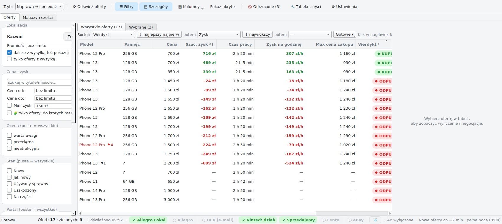
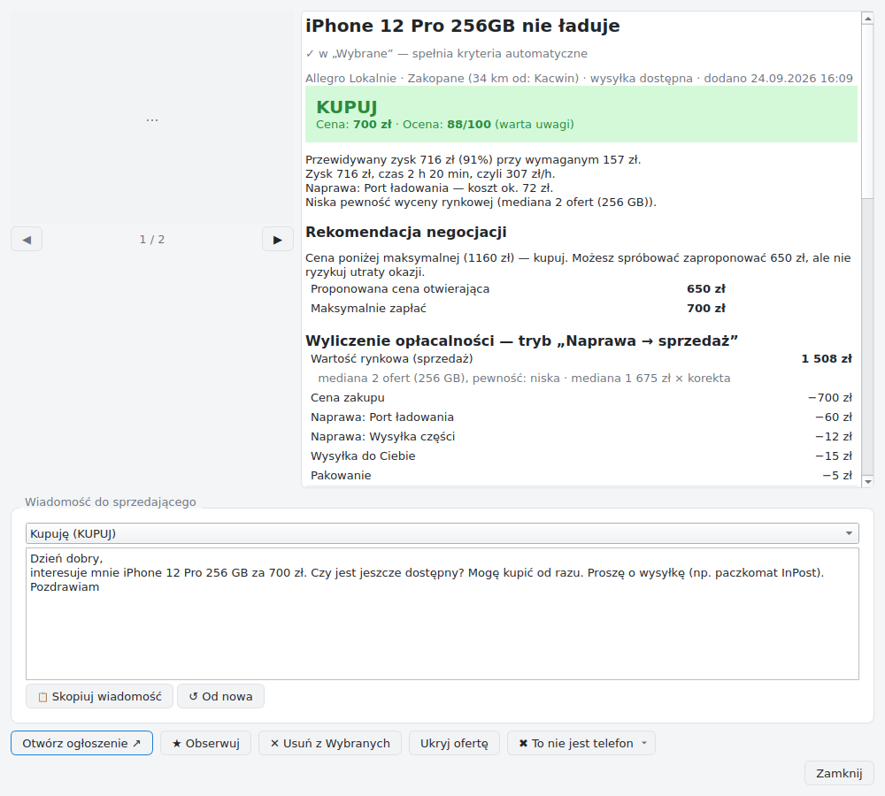

## Szybki start: gotowy plik PhoneBot.exe

1. Wejdź na GitHubie w zakładkę **Actions** → workflow **build-windows** → ostatni udany przebieg
   (zielony) → sekcja **Artifacts** → pobierz **PhoneBot-windows** (plik ZIP z `PhoneBot.exe`).
   Jeśli oznaczysz wersję tagiem `v…` (np. `v1.0.0`), plik trafi też do zakładki **Releases**.
2. Rozpakuj i uruchom `PhoneBot.exe`; nie wymaga instalowania Pythona.
   Windows SmartScreen może ostrzec o nieznanym wydawcy (plik nie jest podpisany cyfrowo).
   Kliknij wtedy „Więcej informacji” → „Uruchom mimo to”.
3. Przy pierwszym uruchomieniu:
   - sprawdź miejscowość w panelu filtrów (domyślnie Kacwin),
   - przejrzyj **⚙ Ustawienia** (zysk, prowizje) i **🔧 Tabelę części**,
   - kliknij **⟳ Odśwież oferty** (F5).
   - W tle program trenuje klasyfikator tytułów (kilka sekund) i **jednorazowo pobiera model zdjęć**
     (176 MB z Hugging Face). Postęp widać na pasku stanu („AI: …”). Potem działa bez internetu.

Pierwsze pobranie nie wysyła powiadomień, bo wszystkie oferty są wtedy „nowe”.
Powiadomienia przychodzą od kolejnych odświeżeń.

### Budowanie PhoneBot.exe samodzielnie

```powershell
pip install -r requirements.txt pyinstaller
pyinstaller --noconfirm phonebot.spec     # wynik: dist\PhoneBot.exe
dist\PhoneBot.exe --self-test             # moduły, lokalne AI (bez pobierania modelu) i okno
```

## Uruchomienie na Windows (tryb deweloperski)

1. Zainstaluj **Python 3.12** z [python.org](https://www.python.org/downloads/windows/)
   i zaznacz „Add python.exe to PATH”.
2. Otwórz PowerShell w folderze projektu i wykonaj:

   ```powershell
   py -3.12 -m venv .venv
   .\.venv\Scripts\Activate.ps1
   pip install -r requirements-dev.txt
   ```

   Jeśli PowerShell blokuje aktywację, wykonaj raz:
   `Set-ExecutionPolicy -Scope CurrentUser RemoteSigned`.
3. Uruchom aplikację: `python -m phonebot`.
   Kliknij **⟳ Odśwież oferty** (F5), aby pobrać ogłoszenia z portali.
4. Testy: `python -m pytest`.
5. Demo wyceny w konsoli: `python -m phonebot.demo`.

### Automatyczne odświeżanie i praca w tle

- **Odświeżanie przyrostowe** (od wersji 1.15): każdy portal jest sprawdzany osobno, mniej więcej **co 2 minuty**.
  Odstęp ma losową zmienność ±20 s, żeby zapytania nie szły w równym rytmie.
  - Program czyta wyniki od najnowszych, tylko jedną, najszerszą frazę („iphone”). Kończy na stronie, na której
    są już 3 znane ogłoszenia, więc pobiera tylko nowe oferty.
  - Wolny albo niedziałający portal nie opóźnia pozostałych.
  - Gdy portal zablokuje pobieranie (403/429/captcha), odstęp dla niego rośnie: 2 → 5 → 15 → 60 min. Po udanej
    próbie wraca do 2 min. Pasek statusu źródeł pokazuje to na znaczniku portalu (np. „zablokowane · co 15 min”),
    a podpowiedź podaje, kiedy będzie następna próba.
  - Minimalny odstęp każdego portalu, kolejne odstępy po blokadach i pozostałe wartości ustawisz w Ustawieniach →
    Ogólne i pobieranie. Po wyłączeniu szybkiego odświeżania program wraca do pełnego pobierania co N minut.
  - Nowe oferty mają w kolumnie „Dodano” znacznik **🆕 NOWE** przez 30 minut.
- **Stare oferty:**
  - „Wybrane” i obserwowane: co godzinę program sprawdza stronę ogłoszenia, czy nadal istnieje i czy zmieniła się
    cena. Zmiana trafia do historii cen, a obniżka wywołuje powiadomienie. W tym samym przebiegu sprawdzane są
    **okazje** (oferty, które przy pojawieniu się dostały KUPUJ lub NEGOCJUJ) — najwyżej 40 stron na godzinę.
  - **Otwarcie oferty** (panel szczegółów, pełne okno, telefon): program sprawdza w tle jej stronę, jeśli nie robił
    tego od godziny. Sprzedana / zarezerwowana od razu dostaje oznaczenie ⌛ i znika z „Wszystkie oferty”.
  - **Zaległe powiadomienia Telegram** (po ciszy nocnej, limicie na godzinę): przed wysłaniem program sprawdza
    stronę oferty — o sprzedanych nie powiadamia.
  - Pozostałe oferty: raz na dobę w nocy (od 3:00) program robi **pełne pobranie kontrolne** (wszystkie frazy
    i strony — wyłapuje oferty pominięte przez szybkie odświeżanie) i sprawdza strony do 300 ofert.
  - Oferty sprzedane, zarezerwowane albo usunięte dostają oznaczenie „nieaktualna” z powodem (w podpowiedzi
    i szczegółach). **Vinted** pokazuje sprzedane i zarezerwowane przedmioty z normalną stroną (kod 200); program
    czyta stan przedmiotu z danych strony (`can_buy`, `is_reserved` — sprawdzone sondą `scripts/probe_sold.py`,
    pod koniec ~2 MB strony, dlatego sprawdzenie pobiera całą stronę). Zarezerwowana oferta wraca jako aktywna,
    gdy znów pojawi się w wynikach wyszukiwania (rezerwacja anulowana).
  - Strony ofert sprawdzane są na Allegro Lokalnie, Vinted i Sprzedajemy.pl. Na pozostałych portalach zniknięcie
    wykrywa nocne pełne pobranie.
- **Archiwum:** oferty starsze niż 3 dni znikają z tabeli, ale zostają w bazie do statystyk i wyceny rynkowej.
  „Wybrane” i obserwowane nie są archiwizowane.
- **Porównanie** (`python tools/refresh_benchmark.py`, makieta Vinted, 2000 ogłoszeń, domyślne ustawienia trybu naprawy):

  | | Przed: pełne co 15 min | Po: szybkie co ~2 min |
  |---|---|---|
  | Zapytania na jeden przebieg (5 nowych ofert) | 33 | 7 (sesja, 1 strona wyników, 5 profili nowych sprzedawców) |
  | Czas przebiegu jednego portalu (limit 4 s/zapytanie) | ok. 132 s | ok. 28 s |
  | 150 nowych naraz | — | 23 zapytania, ok. 92 s |
  | Średnio po ilu minutach widać nową ofertę | ok. 9,7 min | ok. 1,5 min |
  | Zapytania na godzinę do jednego portalu | ok. 132 | ok. 211 (+ nocne pełne pobranie) |

  Pojedynczy przebieg jest 4–5 razy lżejszy, a nowe oferty widać kilka razy szybciej. Łącznie na godzinę zapytań
  jest więcej, bo przebiegów jest więcej. Rozkładają się jednak równomiernie, a przy blokadzie odstęp sam rośnie.
- Zamknięcie okna chowa aplikację do **zasobnika systemowego** (obok zegara) i odświeżanie działa dalej.
  Kliknij ikonę, aby wrócić. Całkowite zamknięcie: prawy przycisk na ikonie → „Zakończ”.
  To zachowanie wyłączysz w Ustawieniach.
- O nowych **zielonych** ofertach, a opcjonalnie także o obniżce ceny do zielonej, informuje
  **powiadomienie Windows**. Każda oferta jest zgłaszana tylko raz.

### Powiadomienia Telegram

**Połączenie (raz, ok. 2 minut):**

1. W Telegramie wyszukaj **@BotFather** (niebieski znaczek weryfikacji) i wyślij `/newbot`.
2. Podaj nazwę bota (np. *Mój PhoneBot*) i login kończący się na `bot` (np. `kacwin_phone_bot`).
3. BotFather odpisze **tokenem** (np. `123456789:AAH…`). Wklej go w **⚙ Ustawienia → Powiadomienia →
   Token bota**. Nikomu go nie pokazuj.
4. Otwórz rozmowę ze swoim botem (link w wiadomości od BotFather) i wyślij mu `/start`.
5. Kliknij **Pobierz chat ID** — program odczyta numer Twojej rozmowy z botem.
6. Kliknij **Wyślij test** (na Telegram przyjdzie wiadomość), zaznacz „Wysyłaj powiadomienia na Telegram”
   i zapisz.

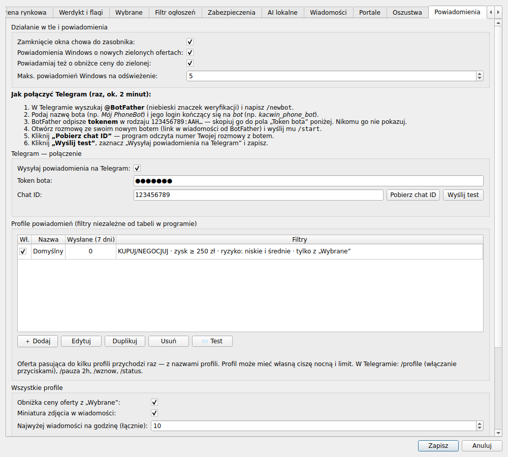

**Profile powiadomień (od wersji 1.22):** kilka zestawów filtrów, każdy z nazwą i własnym włącznikiem,
niezależnych od filtrów tabeli w programie — np. „Naprawa – blisko domu” i „Resell – iPhone 13–15”.
Edycja w **⚙ Ustawienia → Powiadomienia → Profile powiadomień** (przyciski Dodaj / Edytuj / Duplikuj /
Usuń / Test) i na telefonie (zakładka **Telegram**). Każdy filtr jest opcjonalny (puste = bez ograniczeń):

| Filtr | Co robi |
|---|---|
| tryb | wycena w trybie „naprawa → sprzedaż” albo „szybki resell” (albo jak w programie) |
| modele i pamięć | zaznaczenie **całej generacji** (np. „iPhone 13 — cała generacja”) wybiera wszystkie jej modele |
| cena od–do, min. zysk, min. zysk/h, min. ocena | progi z wyceny |
| werdykty | KUPUJ, NEGOCJUJ, DO WERYFIKACJI |
| stan, portale | jak w filtrach tabeli |
| promień i wysyłka | „do 30 km”, opcjonalnie „dalsze oferty z wysyłką też”; tylko z wysyłką / tylko odbiór |
| kraj | tylko Polska albo Polska + zagranica |
| magazyn | tylko oferty, do których masz część na stanie |
| ryzyko oszustwa | maks. poziom — domyślnie **tylko niskie**; osobno: pomijaj poważne flagi (iCloud, IMEI) |
| wykluczone słowa | w tytule lub opisie, np. `icloud, atrapa` |

- Oferta pasująca do **kilku profili przychodzi raz**, z dopiskiem „📋 Profil: Naprawa – blisko domu ·
  Resell – iPhone 13–15”.
- Podczas edycji okno pokazuje na żywo: **„Z ostatnich 24 godzin ten profil wysłałby X powiadomień”**,
  przykładowe oferty i najczęstsze powody odpadania (np. „za daleko (14)”) — liczone w tle.
- **Wyślij testowe powiadomienie z tego profilu** — najlepsza pasująca oferta z 24 h (albo 7 dni) w takiej
  postaci, w jakiej przyjdzie naprawdę, z dopiskiem TEST.
- Na liście profili: liczba powiadomień wysłanych z każdego profilu **w ostatnim tygodniu**.
- **Cisza nocna i limit na godzinę** są globalne; profil może mieć **własną** ciszę i niższy limit.
  Wiadomość czeka tylko, gdy wszystkie pasujące profile są w ciszy.
- **Dotychczasowe ustawienia** (kryteria Telegrama i „Wybrane”) zostały przeniesione do profilu
  **„Domyślny”** — działa dokładnie tak jak wcześniej, dopóki go nie zmienisz.
- Obniżki cen ofert z „Wybrane” (opcja „Obniżka ceny”) przychodzą jak dotąd — niezależnie od profili.
- Każda oferta tylko **raz** (zapisane w bazie), nigdy oferty sprzed pierwszego włączenia powiadomień
  ani z pierwszego pobrania do pustej bazy.

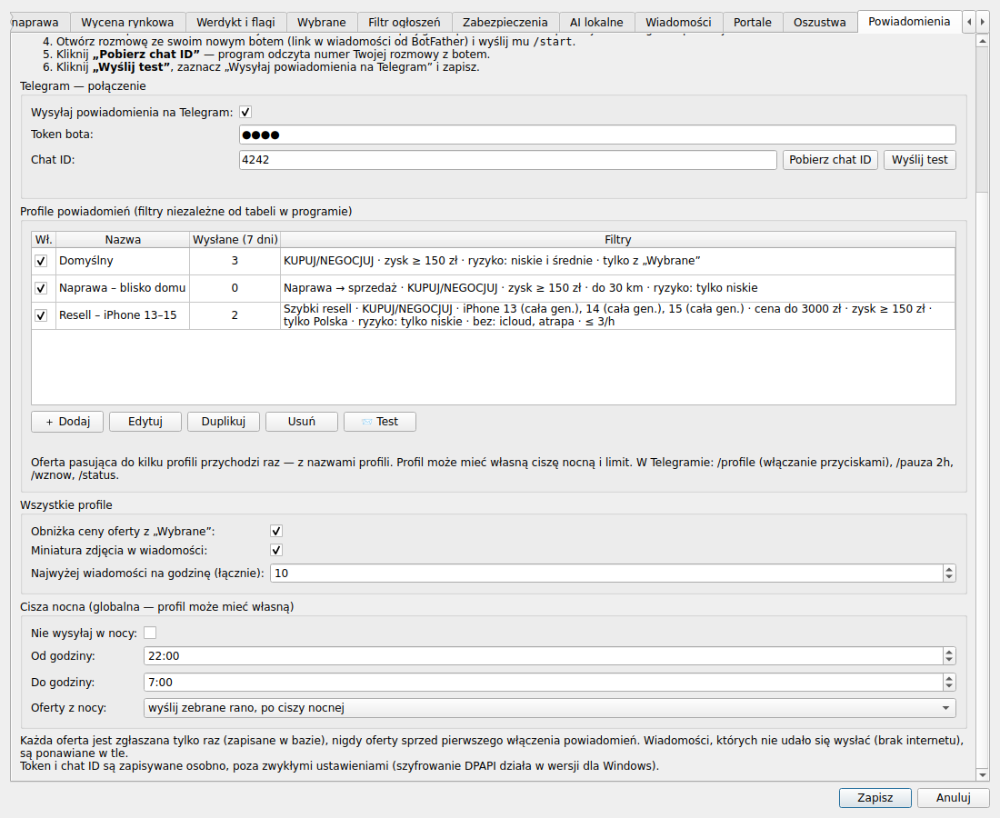
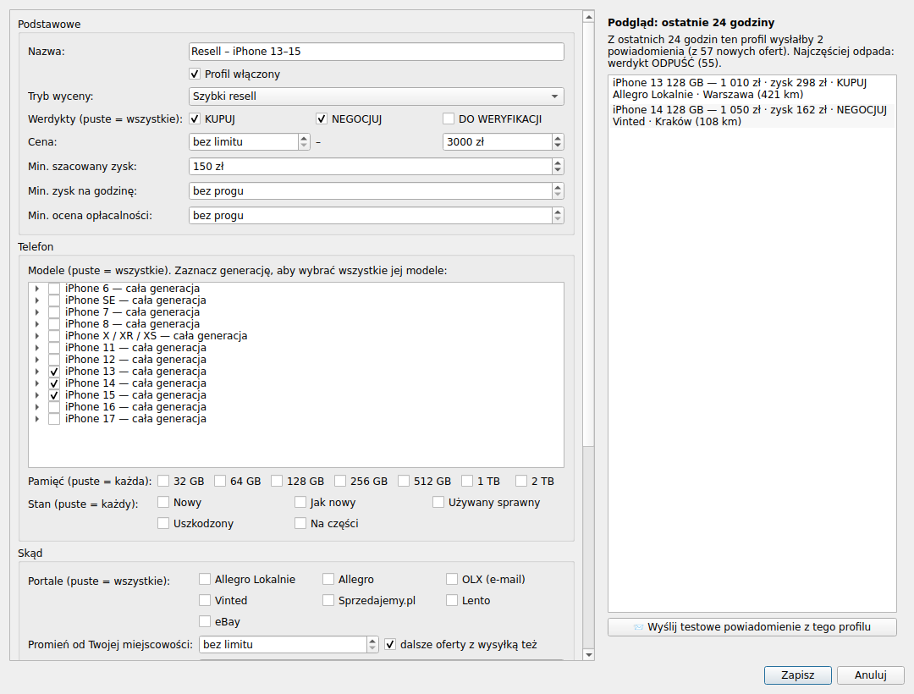
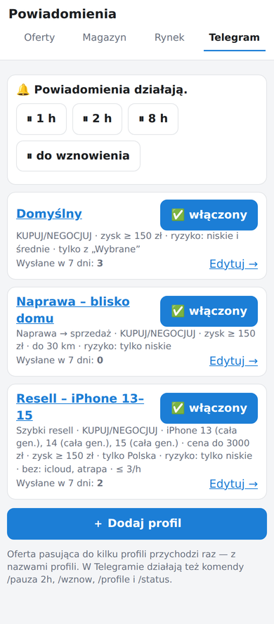
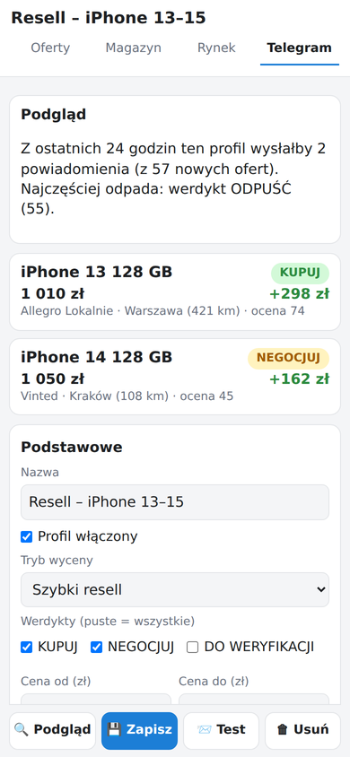

**Komendy w Telegramie** (bot odbiera je z komputera długim odpytywaniem — bez serwera wystawionego do
internetu; odpowiada **tylko na czat o ID z ustawień**, innych użytkowników ignoruje bez odpowiedzi):

| Komenda | Działanie |
|---|---|
| `/pauza 2h` | wstrzymuje powiadomienia (np. `30m`, `2h`, `1d`; samo `/pauza` — do `/wznow`). Oferty z czasu pauzy nie przyjdą później — są w programie |
| `/wznow` | wznawia (i mówi, ile ofert pominięto) |
| `/profile` | lista profili z liczbą wysłanych w 7 dni i **przyciskami włącz / wyłącz** pod wiadomością |
| `/status` | wersja, pauza, liczba ofert i zielonych, ostatnie odświeżenie, stan każdego źródła, kolejka |

Pauzę i włączniki profili masz też na telefonie (zakładka **Telegram**: ⏸ 1 h / 2 h / 8 h / ▶ Wznów).

**Treść:** model, pamięć, cena, szacowany zysk, werdykt, portal, miejscowość z odległością, link do
ogłoszenia i miniatura zdjęcia. Przy NEGOCJUJ — proponowana cena i gotowa wiadomość do sprzedającego
(z zadania „Wiadomości”) w bloku, który Telegram kopiuje jednym dotknięciem.

**Cisza nocna i limit:** w godzinach ciszy (domyślnie 22:00–7:00) wiadomości czekają do rana albo są
pomijane — do wyboru. Najwyżej 10 wiadomości na godzinę łącznie (ustawienie); nadmiar przychodzi jako jedno
podsumowanie z listą ofert. Profil może mieć własną ciszę i limit (patrz wyżej).

**Niezawodność:** wiadomości czekają w kolejce w bazie; po błędzie (np. brak internetu) są ponawiane
w tle (po 1, 5, 15, 30 min…), bez duplikatów. Wysyłka działa w tle — po każdym odświeżeniu i co 5 minut.

**Bezpieczeństwo:** token bota i chat ID nie są w kodzie ani w zwykłych ustawieniach — program zapisuje
je osobno, **zaszyfrowane kontem Windows (DPAPI)**; skopiowana baza nie zdradzi tokenu na innym komputerze.
Token zapisany jawnie przez starszą wersję jest przenoszony do szyfrowanego magazynu przy pierwszym
uruchomieniu.

### PhoneBot na telefonie (przez Tailscale)

Program może udostępnić lekką stronę dla telefonu — ten sam stan co w oknie (ta sama baza):

- **Oferty:** zakładki **Wszystkie / Wybrane** z licznikami, sortowanie i filtry (model, portal, werdykt, cena,
  zysk, wyszukiwanie), kolorowe werdykty, znaczniki ★ obserwowane, 🛒 kupione, 🧩 masz część;
- **szczegóły oferty:** wyliczenie (zysk, max cena, czas pracy, zysk na godzinę, trend ceny, czas aktywności
  ogłoszeń), **gotowa wiadomość do sprzedającego z przyciskiem „Kopiuj”**, „Otwórz ogłoszenie”;
- **akcje:** ★ Obserwuj, Ukryj, To jest / To nie jest telefon oraz **🛒 Kupiłem** — zapisuje transakcję
  (z ceną, którą wpiszesz, i wyceną z tej chwili) i zdejmuje z magazynu pasujące części; resztę (naprawa,
  sprzedaż) wpisujesz w zakładce „Transakcje” na komputerze;
- **Magazyn** (podgląd): części na stanie, ceny, ostrzeżenia o kończących się częściach;
- **Rynek** (uproszczony): trend, mediana, czas aktywności ogłoszeń, nowe ogłoszenia, wykres cen (mediana
  i zakres), najlepsze pory na zakupy;
- **aplikacja na ekranie głównym (PWA)**; gdy komputer albo Tailscale są niedostępne, zamiast błędu
  przeglądarki pojawia się strona „Brak połączenia z PhoneBot” z listą rzeczy do sprawdzenia.

Zmiany z telefonu od razu widać w oknie programu (tabela, magazyn, transakcje). Linki „Szczegóły w PhoneBot”
w powiadomieniach Telegram otwierają ofertę na tej stronie.

| Szczegóły oferty | Magazyn | Rynek |
|---|---|---|
| 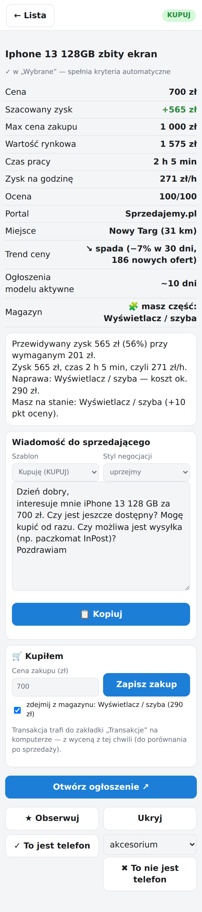 | 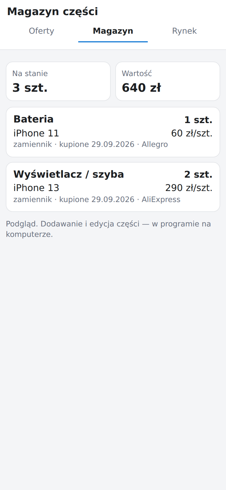 | 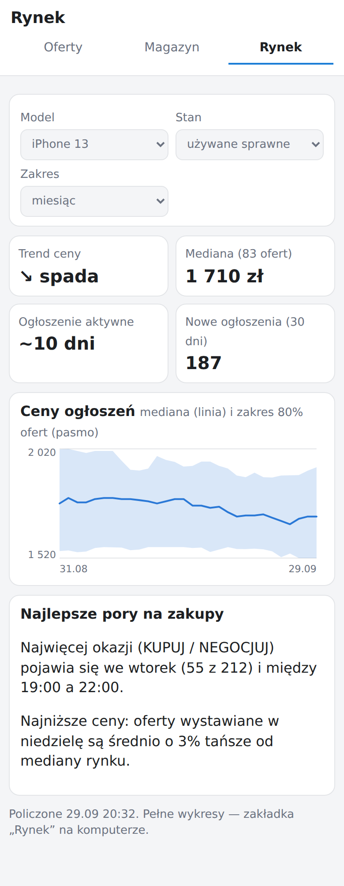 |

**Bezpieczeństwo — serwer nie jest wystawiany do internetu:**

- nasłuch wyłącznie na tym komputerze (`127.0.0.1`) albo na adresie Tailscale `100.x.y.z` — inne adresy
  (np. `0.0.0.0`, sieć domowa) są zablokowane w kodzie;
- logowanie PIN-em (zapisany jako skrót PBKDF2, zaszyfrowany jak token Telegrama), sesje na 30 dni,
  ochrona formularzy (CSRF), blokada na 5 minut po 5 błędnych PIN-ach, sprawdzanie adresu (ochrona
  przed „DNS rebinding”), nagłówki bezpieczeństwa; wszystkie strony z danymi (oferty, magazyn, rynek)
  wymagają PIN-u;
- **nigdy nie używaj `tailscale funnel`** ani przekierowania portu na routerze — to wystawiłoby stronę publicznie.

**Konfiguracja krok po kroku — komputer (Windows):**

1. Zainstaluj **Tailscale** z <https://tailscale.com/download> i zaloguj się (konto Google, Microsoft
   albo GitHub; plan Personal jest darmowy). Ikona Tailscale pojawi się przy zegarze.
2. W PhoneBot: **⚙ Ustawienia → Telefon** — wpisz **PIN** dwa razy (min. 4 znaki, najlepiej 6+ cyfr),
   zaznacz **„Włącz wersję na telefon”** (to jest włącznik serwera), zostaw dostęp „Tylko ten komputer”
   i zapisz. Na pasku stanu pojawi się „📱 Telefon: działa”.
3. Otwórz **Wiersz polecenia** (Start → wpisz `cmd`) i wpisz `tailscale serve --bg 8765`. Tailscale
   udostępni program pod adresem `https://NAZWA-KOMPUTERA.NAZWA-SIECI.ts.net` **tylko w Twojej sieci
   Tailscale**, z certyfikatem HTTPS. Za pierwszym razem Tailscale może pokazać link do włączenia
   certyfikatów HTTPS w panelu — otwórz go i potwierdź. Adres sprawdzisz poleceniem `tailscale serve status`.
   To ustawienie zostaje po restarcie komputera.
4. Wklej ten adres w **Ustawienia → Telefon → Adres dla telefonu** (dla linków z Telegrama) i zapisz.

**Konfiguracja krok po kroku — telefon:**

5. Zainstaluj aplikację **Tailscale** (App Store / Google Play), zaloguj się **tym samym kontem** co na
   komputerze i włącz przełącznik połączenia (iPhone zapyta o zgodę na VPN — zezwól).
6. Otwórz w przeglądarce adres z punktu 3 i podaj PIN.
7. Dodaj stronę do ekranu głównego: **iPhone (Safari)** — przycisk Udostępnij → **„Do ekranu początkowego”**;
   **Android (Chrome)** — menu ⋮ → **„Zainstaluj aplikację”** albo „Dodaj do ekranu głównego”.
   Od teraz PhoneBot otwiera się jak aplikacja, na pełnym ekranie.

**Gdy nie działa:**

- „Brak połączenia z PhoneBot” — sprawdź, czy komputer jest włączony, PhoneBot działa (także zminimalizowany
  do zasobnika), a na telefonie Tailscale jest włączony (w aplikacji Tailscale komputer ma status „Connected”).
- Strona się nie otwiera po zmianie portu w ustawieniach — powtórz `tailscale serve --bg NOWY-PORT`.
- Zapomniany PIN — ustaw nowy w Ustawienia → Telefon (wszystkie telefony zostaną wylogowane).

Bez `tailscale serve`: wybierz dostęp „Adres Tailscale 100.x.y.z” i otwórz `http://100.x.y.z:8765`
(adres komputera widać w aplikacji Tailscale). Ruch i tak jest szyfrowany przez Tailscale, ale bez HTTPS
Android nie zainstaluje strony jako aplikacji (działa zwykły skrót), strona „Brak połączenia” nie działa,
a „Kopiuj” zaznacza tekst zamiast kopiować w tle na części przeglądarek.

Serwer działa tylko, gdy działa PhoneBot (także zminimalizowany do zasobnika).

### Status źródeł i diagnostyka

Pod paskiem narzędzi widać status każdego portalu z ostatniego pobrania:

| Status | Znaczenie | Co zrobić |
|---|---|---|
| ✔ działa (N) | portal zwrócił N ofert | nic |
| ⚠ brak ofert | portal odpowiada, ale nic nie zwrócił | możliwa zmiana formatu — uruchom Diagnostykę |
| ⛔ zablokowane | portal blokuje automatyczne pobieranie (403, captcha) | automat robi pauzę 3 h (ręczne „Odśwież” ją pomija); jeśli trwa — wyłącz źródło |
| ✖ zmiana formatu | portal zmienił API lub stronę | adapter do aktualizacji — prześlij raport Diagnostyki |
| ✖ brak połączenia | brak internetu / zapora | sprawdź połączenie |

Najedź myszą na status, żeby zobaczyć szczegóły błędu. Przycisk **🩺 Diagnostyka**
sprawdza każdy portal osobno i pokazuje etap problemu (połączenie, blokada, parsowanie,
filtrowanie). Raport zapisuje się w `%LOCALAPPDATA%\PhoneBot\diagnostyka.txt`.
Ten sam raport wygenerujesz poleceniem `PhoneBot.exe --diagnose`.

Workflow **live-sources** w GitHub Actions codziennie sprawdza portale na żywo i oznacza
przebieg na czerwono, gdy któryś adapter przestanie zwracać oferty.

### Twoja miejscowość

Domyślnie ustawiony jest Kacwin. Zmienisz go w panelu filtrów („Lokalizacja → Zmień…”)
albo w ustawieniach. Miejscowość możesz wybrać na trzy sposoby:

- wpisać jej nazwę i kliknąć „Szukaj” (OpenStreetMap znajdzie dowolną miejscowość w Polsce),
- wybrać z wbudowanej listy (Podhale i większe miasta; działa bez internetu),
- wpisać współrzędne ręcznie.

Od wybranej miejscowości liczone są odległości do ofert, koszt dojazdu przy odbiorze osobistym
i filtr promienia.

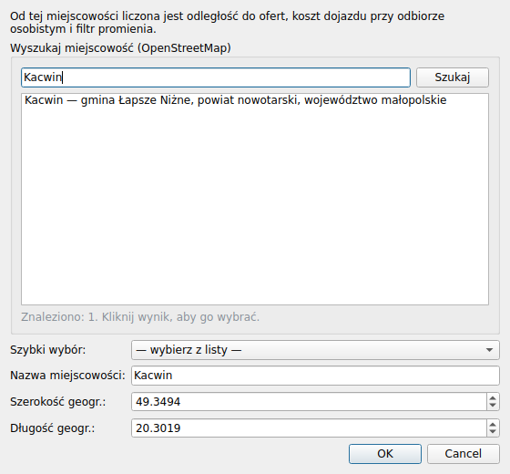

### Filtr ogłoszeń i „Odrzucone”

Zanim oferta trafi do tabeli, przechodzi przez kilka etapów:

1. **Kategoria portalu** — szukanie odbywa się w kategorii telefonów (po ID kategorii, patrz niżej);
   gdy portal podaje kategorię oferty, „Akcesoria GSM” odpada.
2. **„Kupię / zamienię / szukam”** na początku tytułu → odrzucone („Sprzedam lub zamienię” przechodzi).
3. **Kilka generacji w tytule** — „13 14 15”, „12/13/14”, „iPhone 7 8 SE” to prawie zawsze etui lub szkło.
   Pojemność („128 GB”), bateria („85%”), okres („11 miesięcy”), ocena („8/10”) i wersja iOS nie są liczone.
4. **Akcesoria i części z kontekstem** — „Etui do iPhone 13” odpada, ale „iPhone 13 128GB + etui gratis”
   czy „iPhone 12 z pudełkiem i ładowarką” przechodzą. Lista słów obejmuje języki sąsiednie
   (czeski/słowacki: *obal, kryt, pouzdro*; niemiecki: *Hülle, Panzerglas*; litewski: *dėklas*;
   angielski: *case, cover, screen protector*; także francuski/hiszpański/włoski).
5. **Model** — ogłoszenie bez rozpoznanego modelu iPhone'a odpada.
6. **Kraj (Vinted)** — domyślnie widać też oferty z zagranicy (z flagą), patrz „Oferty z zagranicy” niżej.
7. **Sprzedawca seryjny** — patrz niżej.
8. **Test ceny** — cena poniżej 15% mediany rynkowej: jeśli opis wskazuje na akcesorium/atrapę,
   oferta odpada; w przeciwnym razie zostaje z czerwoną flagą „Cena nierealnie niska — sprawdź”.

Odrzucone ogłoszenia z powodem znajdziesz pod przyciskiem **🚫 Odrzucone** na pasku narzędzi.
Przycisk **„✔ To jest telefon”** przywraca ofertę do tabeli i zapamiętuje ją, więc filtr nie odrzuci
jej ponownie. Listy słów (akcesoria, części, „kupię”, słowa dodatków itd.) oraz próg ceny edytujesz
w **Ustawienia → Filtr ogłoszeń**; zakładka podpowiada też słowa, które najczęściej dawały
fałszywe odrzucenia. Po zmianie reguł (także po aktualizacji programu) oferty zapisane wcześniej
są sprawdzane ponownie — to, co nie przejdzie, trafia do „Odrzucone” (obserwowanych nie rusza).

### Zabezpieczenia werdyktu i „DO WERYFIKACJI”

Nowy werdykt **DO WERYFIKACJI** (szara etykieta) oznacza: „wygląda na okazję, ale coś się nie zgadza —
najpierw sprawdź ogłoszenie”. Taka oferta nigdy nie jest zielona i nie wywołuje powiadomienia.
Wszystkie progi są w **Ustawienia → Zabezpieczenia**:

| Reguła | Domyślnie | Skutek |
|---|---|---|
| Cena poniżej % wartości rynkowej (sprawny) | 30% | najwyżej DO WERYFIKACJI |
| Cena poniżej % wartości rynkowej (uszkodzony / na części) | 15% | najwyżej DO WERYFIKACJI |
| Zysk powyżej % zainwestowanej kwoty | 150% | najwyżej DO WERYFIKACJI |
| Nieznana pamięć (wycena z mediany wszystkich pojemności) | włączone | najwyżej DO WERYFIKACJI |
| Flaga ostrzegawcza (brak zdjęć, simlock, niesprawdzony…) | — | najwyżej NEGOCJUJ |
| Poważna flaga (iCloud, IMEI, MDM, podróbka) | — | najwyżej DO WERYFIKACJI |

Uszkodzone telefony mają niższy próg ceny, bo tani uszkodzony iPhone to normalna okazja do naprawy.
W szczegółach oferty widać, który powód obniżył werdykt („Werdykt obniżony z KUPUJ na …”).

**Czysta wycena rynkowa.** Oferty bez rozpoznanej pamięci nie są już danymi rynkowymi (to najczęściej
akcesoria), ceny poniżej 30% mediany są pomijane, a oferty z flagą „cena nierealnie niska” nie wchodzą
do mediany. Wcześniej tanie etui zapisane jako „iPhone 13” obniżały wycenę prawdziwych telefonów.

### Portale i ceny referencyjne

| Portal | Jak pobierane | Stan (sprawdzone 26.09.2026 z GitHub Actions) |
|---|---|---|
| Allegro Lokalnie | strona wyników (JSON-LD) | działa |
| Sprzedajemy.pl | strona wyników (JSON-LD) | działa |
| Vinted | API katalogu (anonimowa sesja) | działa („best effort”) |
| **Lento.pl** | strony kategorii *Telefony komórkowe → Apple* (wyszukiwarka jest wyłączona w robots.txt) | działa |
| **Allegro** | **oficjalne REST API** (klucze aplikacji) | serwis osiągalny; działanie zależy od dostępu Twojej aplikacji |
| **eBay** | **oficjalne Browse API** (klucze aplikacji) | serwis osiągalny z kluczem |

Każdy portal to osobny adapter: błąd albo blokada jednego nie przerywa pozostałych. Wszystkie oferty
przechodzą ten sam filtr, wycenę, listę „Wybrane” i powiadomienia, a portal widać w filtrze i na pasku
stanu. Codzienny test „live-sources” (GitHub Actions) sprawdza każdy adapter i robi się czerwony, gdy
portal przestanie zwracać oferty (Allegro/eBay — gdy w repozytorium są sekrety z kluczami).

**Allegro (oficjalne API):** na <https://apps.developer.allegro.pl> „Dodaj aplikację” (dostęp tylko do
danych publicznych, bez logowania użytkownika), skopiuj **Client ID** i **Client Secret** do
**⚙ Ustawienia → Portale** i włącz Allegro w „Ogólne i pobieranie”. Program szuka w kategorii
„Smartfony i telefony komórkowe” ze stanem używany/uszkodzony (identyfikatory odczytuje z API kategorii).
Program nie loguje się na Twoje konto Allegro — nie grozi mu blokada. Jeśli Allegro nie udostępni Twojej
aplikacji wyszukiwania ofert, status pokaże „ZABLOKOWANE” z wyjaśnieniem (program tego nie obchodzi).

**eBay (oficjalne API):** na <https://developer.ebay.com> załóż konto, utwórz klucze **Production** i wpisz
**App ID** oraz **Cert ID** w Ustawienia → Portale; wybierz rynki (np. Niemcy, Wielka Brytania, USA).
Tylko oferty z **wysyłką do Polski**; cena przeliczona kursem **NBP** (darmowe API; bez połączenia —
ostatni kurs), zawsze z kosztem wysyłki, a spoza UE z szacunkiem **VAT 23%, cła (telefony: 0%) i opłaty
za odprawę** (do zmiany). Każda oferta ma flagę **„Zakup na odległość”** z korektą oceny (domyślnie −10 pkt,
do zmiany), a iPhone 14 i nowsze z USA — **„tylko eSIM”** z niższą wartością odsprzedaży (domyślnie −15%).

**Ta sama oferta na kilku portalach** (model, pamięć, cena, miejscowość) jest pokazywana raz — z dopiskiem
„+1” w kolumnie Portal i listą portali z linkami w szczegółach.

**Ceny referencyjne** (tylko do wyceny odsprzedaży, nie oferty do kupna):

- **Refurbed** — raz dziennie, dla najczęstszych modeli z bazy, najniższa cena każdej pojemności z danych
  strukturalnych strony, 10 s między zapytaniami (robots.txt);
- **Swappie i Back Market blokują automatyczne pobieranie** (odpowiedź 403 od Cloudflare — sprawdzone).
  Program tego nie obchodzi; ich ceny możesz wpisać ręcznie w Ustawienia → Portale → „Ceny ręczne”;
- wartość odsprzedaży = cena referencyjna × **80%** (do zmiany), mieszana z medianą ogłoszeń
  (domyślnie 50/50); stan sklepu → stan w programie w edytowalnym mapowaniu;
- w szczegółach oferty widać sklep, cenę i **datę pobrania**; gdy sklep nie odpowiada, używana jest ostatnia
  zapisana cena, a bez ceny referencyjnej wycena działa jak dotąd (sama mediana).

### OLX z powiadomień e-mail

OLX blokuje automatyczne pobieranie, więc PhoneBot korzysta z oficjalnego kanału OLX, czyli powiadomień
e-mail o nowych ogłoszeniach:

1. Na OLX wyszukaj np. „iPhone” w kategorii telefonów, ustaw filtry i kliknij „Obserwuj wyszukiwanie”
   z powiadomieniami e-mail.
2. W **Ustawieniach → Portale → OLX** wpisz adres e-mail i **hasło aplikacji** do poczty. W Gmailu:
   Konto Google → Bezpieczeństwo → Weryfikacja dwuetapowa → Hasła aplikacji. W innych skrzynkach
   włącz dostęp IMAP. Kliknij „Sprawdź pocztę”.
3. Włącz „OLX (e-mail)” w zakładce „Ogólne i pobieranie”.

Jak to działa:
- Program łączy się z Twoją skrzynką przez IMAP **tylko do odczytu**: maile zostają nieprzeczytane,
  nic nie jest wysyłane ani usuwane.
- Przy każdym odświeżeniu czyta maile od OLX z ostatnich 7 dni. Każdy mail pobiera raz (wynik zapisuje
  w `olx_mail_cache.json`).
- Hasło jest zapisywane zaszyfrowane, tak jak token Telegrama.
- Z maila znane są tytuł, cena, miasto, link i zdjęcie, bez opisu i danych sprzedającego. Wycena opiera
  się więc na tytule, a ocena ryzyka oszustwa ma mniej danych.
- Oferty przechodzą przez te same filtry, wycenę, listę „Wybrane” i powiadomienia co z innych portali.
- Miniatury zdjęć są ładowane z serwera zdjęć OLX, tak jak w programie pocztowym.

Status w pasku źródeł:
- „brak ofert”: nie ma maili od OLX, na przykład gdy powiadomienia są wyłączone.
- „do ustawienia”: poczta odrzuciła logowanie.
- „zmiana formatu”: powiadomienia przychodzą, ale nie udało się z nich odczytać żadnej oferty.
  To znak, że OLX zmienił wygląd maili i parser wymaga aktualizacji.

### Oferty z zagranicy (Vinted)

Vinted pokazuje też ogłoszenia z innych krajów (np. z Czech, Słowacji, Niemiec) z wysyłką do Polski.
W Ustawieniach → Zabezpieczenia → „Oferty z Vinted” wybierasz:

- **Z Polski i z zagranicy** (domyślnie od wersji 1.4.1) — oferty zagraniczne są na liście z flagą
  „Sprzedawca z zagranicy” (kolumna „Flagi” i panel szczegółów). Flaga jest „łagodna”: najwyższy werdykt
  to NEGOCJUJ (limit „przy łagodnej fladze” w Zabezpieczeniach), a w pytaniach do sprzedającego jest
  pytanie o wysyłkę do Polski i jej koszt;
- **Tylko oferty z Polski** — odpada tytuł w obcym języku (np. „obal”, „prodám”, „Hülle”) oraz oferta
  sprzedawcy, którego profil podaje inny kraj niż Polska.

Po aktualizacji do 1.4.1 zapisane ustawienie „tylko z Polski” zmienia się raz na „z Polski i z zagranicy”,
a oferty odrzucone wcześniej za kraj (zakładka „Odrzucone”) wracają na listę — o ile przechodzą pozostałe
reguły (filtr tekstu, sprzedawcy seryjni, test ceny). Wrócić do „tylko z Polski” możesz w każdej chwili.

Wyniki wyszukiwania Vinted nie zawierają kraju sprzedawcy, więc aplikacja sprawdza go w profilu
sprzedawcy — tylko dla ofert, które przeszły filtr tekstu i mają tytuł po polsku (obcy język już
rozstrzyga), najwyżej 20 sprzedawców na odświeżenie (ustawienie), z pamięcią na 30 dni. Pozostali
są sprawdzani przy kolejnych odświeżeniach.

Uwaga: Vinted podaje ceny w walucie kraju, z którego łączy się komputer — z Polski wszystkie ceny są
w złotych (także ofert zagranicznych). Ceny w innej walucie (np. z serwera testowego poza Polską) są pomijane.

### Wykrywanie możliwych oszustw

Działa lokalnie i za darmo (reguły i skróty zdjęć — bez zewnętrznych usług). Każdy sygnał dodaje punkty
(wagi i progi w **⚙ Ustawienia → Oszustwa**); suma daje ryzyko **niskie / średnie / wysokie** z listą powodów:

- **sprzedający:** nowe konto (< 30 dni), brak opinii albo dużo negatywnych, nowe konto z wieloma drogimi
  telefonami — tam, gdzie portal podaje te dane (profil Vinted, opinie eBay); gdzie ich nie podaje,
  sygnał nie działa (program nie zgaduje);
- **tekst:** kontakt poza portalem (WhatsApp, Telegram, e-mail, numer telefonu — zagraniczny osobno),
  „tylko wysyłka” przy bardzo niskiej cenie, przedpłata / BLIK / „link do płatności”, „nowy, zafoliowany”
  albo „prezent” wyraźnie poniżej rynku, opis skopiowany z ogłoszenia innego sprzedającego;
- **zdjęcia** (liczone w tle, zapisywane po ID ogłoszenia): to samo lub prawie to samo zdjęcie u innego
  sprzedającego / w innym mieście (skrót dHash), zdjęcie katalogowe (jednolite białe tło), brak zdjęć;
- **cena:** bardzo niska cena **razem z innym sygnałem** dodaje premię — tak wyglądają typowe oszustwa.

Skutki: **średnie** ryzyko → werdykt najwyżej DO WERYFIKACJI; **wysokie** → czerwona etykieta
**„MOŻLIWE OSZUSTWO”**, oferta nie trafia automatycznie do „Wybrane” i nie wywołuje powiadomień.
W szczegółach są powody i porady bezpiecznego zakupu, a domyślną wiadomością są pytania kontrolne.
Kolumna **„Ryzyko”** (włączana w menu kolumn) jest sortowalna, a w panelu filtrów można filtrować po ryzyku.
Oznaczenia widać też na telefonie i w wiadomościach Telegram.

**Czarna lista:** „⛔ Zablokuj sprzedającego” (prawy przycisk na ofercie albo menu „To nie jest telefon”)
ukrywa jego oferty na wszystkich portalach — ten sam login, ID albo numer telefonu z ogłoszenia (trafiają
do „Odrzucone” z powodem). Listę przejrzysz i zmienisz w Ustawienia → Oszustwa; usunięcie przywraca oferty.

### Sprzedaż zdjęcia iPhone'a zamiast telefonu

Oszustwo wygląda tak: ogłoszenie ma tytuł z modelem iPhone'a i niską cenę, a przedmiotem sprzedaży jest
tylko zdjęcie, wydruk albo plakat telefonu. Zwykle zdradza to drobny dopisek na końcu opisu.
PhoneBot wykrywa to lokalnie i za darmo (`core/photo_scam.py`).

**Pewne wykrycie** (każdy z tych sygnałów wystarczy):
- **jednoznaczne sformułowanie** w tytule albo opisie:
  - polski: „to jest tylko zdjęcie”, „przedmiotem sprzedaży jest zdjęcie”, „nie jest to telefon”;
  - angielski: „photo only”, „picture of iPhone”;
  - niemiecki: „nur Foto”, „kein Handy”;
  - czeski i słowacki: „jen fotka”, „len fotka”;
  - litewski: „tik nuotrauka”.
- **ukryty dopisek**: rozstrzelone litery („t y l k o  z d j ę c i e”), kropki między literami, znaki
  niewidoczne, małe kapitaliki, cyrylica udająca łacinę, emoji 📷 i 🖼;
- **słowo „zdjęcie / foto / plakat / obraz” w tytule przed nazwą modelu** („Zdjęcie iPhone 15 Pro”);
- **kategoria portalu ze zdjęciami lub sztuką**, na przykład Allegro Lokalnie „Kolekcje i sztuka > Sztuka >
  Fotografia” (ID 321811), sprawdzone sondą na portalu. „Elektronika > Fotografia” (aparaty) nie jest oznaczana.

**Słabe sygnały**:
- takie słowo w tytule **po** nazwie modelu;
- „wydruk / plakat / obrazek” w opisie;
- kategoria ogólna (dekoracje, kolekcje, sztuka);
- analiza zdjęcia (CLIP) wskazuje wydruk, plakat albo zrzut ekranu ogłoszenia.

Jeden słaby sygnał daje werdykt najwyżej **DO WERYFIKACJI** z wyjaśnieniem. **Bardzo niska cena** (domyślnie
poniżej 45% wartości rynkowej) razem z którymkolwiek słabym sygnałem albo **dwa słabe sygnały** dają pewne
wykrycie.

**Co się dzieje z pewnymi wykryciami:**
- oferta trafia do widoku **„Odrzucone”** z powodem „MOŻLIWE OSZUSTWO: sprzedaż zdjęcia zamiast telefonu”;
- znika z głównej tabeli, listy „Wybrane”, wersji na telefon i powiadomień Telegram;
- przycisk „To jest telefon” działa jak dotąd, a przywrócona oferta nie jest już sprawdzana;
- program **proponuje dodanie sprzedającego do czarnej listy**. Pyta o każdego raz i niczego nie robi
  bez Twojej zgody.

**Bez fałszywych alarmów:**
- samo słowo „zdjęcie” niczego nie przesądza: „więcej zdjęć na priv”, „zdjęcia prawdziwe”, „stan jak na
  zdjęciach”, „wyślę zdjęcie telefonu z IMEI”, „to nie jest tylko zdjęcie” nie są oznaczane;
- „zdjęcia poglądowe” to osobny sygnał ryzyka w ochronie przed oszustwami, a nie sprzedaż zdjęcia.

**Ustawienia:** wszystkie listy fraz, słów, wykluczeń i kategorii (także ID) edytujesz w Ustawieniach →
Oszustwa. Przykłady takich ogłoszeń uczą też klasyfikator tytułów (klasa „zdjęcie zamiast telefonu”).

**Raport z Twojej bazy:** `PhoneBot.exe --photo-scam-report` pokazuje, ile ofert oznaczono, z przykładami.

**Ograniczenia:**
- Allegro Lokalnie i Sprzedajemy.pl są przeszukiwane w kategorii telefonów, a Allegro Lokalnie nie podaje
  kategorii w wynikach. Dlatego kategoria rozstrzyga głównie wtedy, gdy portal ją podaje.
- Na Vinted nie udało się pobrać drzewa kategorii (API zwraca 404).
- Nowe etykiety CLIP dotyczą zdjęć analizowanych od tej wersji. Sprawdzono je na 20 prawdziwych zdjęciach
  telefonów (workflow `clip-check`): żadne nie przekroczyło progu 80% (najwyżej 61%). Nie było jednak próbek
  prawdziwych zdjęć oszustw, dlatego CLIP jest tylko słabym sygnałem.

### Sprzedawcy seryjni

Jeśli jeden sprzedawca ma co najmniej 3 oferty „iPhone'ów” w cenie poniżej 40% wartości rynkowej,
zostaje oznaczony, a wszystkie jego oferty trafiają do „Odrzucone” (etap „sprzedawca seryjny”) —
także te, które wystawi później. Pomyłkę cofniesz przyciskiem **„✔ Sprzedawca jest w porządku”**
w oknie „Odrzucone”. Wykrywanie działa tam, gdzie portal podaje identyfikator sprzedawcy (Vinted);
Allegro Lokalnie i Sprzedajemy.pl go nie udostępniają, a zgadywanie po samym tytule dawało fałszywe alarmy.

### Kategorie portali

| Portal | Kategoria | ID | Jak działa |
|---|---|---|---|
| Sprzedajemy.pl | Elektronika > Telefony > Telefony komórkowe > Apple iPhone | 1390 | szukanie w tej kategorii; aplikacja sprawdza ID kategorii w odpowiedzi |
| Allegro Lokalnie | Telefony i akcesoria | 4 | portal nie ma osobnej kategorii samych telefonów — akcesoria odsiewa filtr tekstu |
| Vinted | Telefony komórkowe | 3661 | **API Vinted ignoruje filtr kategorii** (sprawdzone 5 wariantami parametru), dlatego tanie akcesoria odcina minimalna cena pobierania (domyślnie 150 zł) |

ID, adresy kategorii i minimalne ceny edytujesz w **Ustawienia → Zabezpieczenia**.

### Lokalne AI (darmowe, na Twoim komputerze)

Reguły z poprzedniego punktu decydują, co trafia do tabeli. Dwie warstwy AI mogą to **potwierdzić
albo podważyć**. Wszystko działa lokalnie, na procesorze, bez płatnych usług i bez wysyłania danych.
Internet jest potrzebny tylko do jednorazowego pobrania modelu zdjęć i do pobrania zdjęcia oferty
(z tego samego serwera co miniatury).

**1. Klasyfikator tytułów** (scikit-learn: TF-IDF na fragmentach słów + regresja logistyczna) rozpoznaje
4 klasy: telefon / akcesorium / część / kupię. Odporny na literówki i obce języki (obal, kryt, Hülle, dėklas…).
Uczy się na:

- zbiorze startowym — 783 tytuły po polsku i w językach sąsiednich (działa od pierwszego uruchomienia),
- ofertach odrzuconych przez reguły (etap → klasa),
- Twoich oznaczeniach: **„✖ To nie jest telefon”** w panelu szczegółów (oferta idzie do „Odrzucone”)
  i „To jest telefon” w oknie „Odrzucone” — te ważą najwięcej,
- ofertach ukrytych ręcznie, jako słaba wskazówka. Ukrytą ofertę, którą model i tak uważa za telefon,
  pomija, bo mogła zostać ukryta np. przez cenę. Można to wyłączyć.

Skuteczność (widoczna w **Ustawienia → AI lokalne**, liczona przy każdym treningu):
**97%** na 20% danych odłożonych przed treningiem i **98% (54/55)** na zestawie kontrolnym prawdziwych
tytułów z portali, których model nigdy nie widzi. Przycisk **„🎓 Douczyć model”** uczy go od nowa
(kilka sekund, w tle). Automatycznie douczy się po 50 nowych oznaczeniach (ustawienie) albo po 500 nowych
ofertach odrzuconych przez reguły.

**2. Analiza zdjęcia** (CLIP ViT-B/32 w onnxruntime, bez karty graficznej): główne zdjęcie oferty
jest porównywane z opisami „smartfon”, „etui”, „szkło ochronne”, „pudełko”. Model (176 MB) pobiera się raz,
z przypiętej wersji pliku na Hugging Face i z kontrolą sumy SHA-256. Analizowane są tylko oferty z werdyktem KUPUJ, NEGOCJUJ lub DO WERYFIKACJI —
najlepsze najpierw, **każda raz** (wynik, także błąd pobrania, zostaje w bazie). Zdjęcia z jednego serwera
pobierane są nie częściej niż co 1 s. Analiza jednego zdjęcia trwa ok. **70 ms** (zmierzone kodem programu
na 2 rdzeniach w GitHub Actions, Linux i Windows) — dłużej trwa samo, celowo powolne, pobieranie zdjęć.

Sprawdzone kodem programu na 80 prawdziwych zdjęciach z Vinted (po 20 każdego rodzaju) — uczciwie
o ograniczeniach:

| Co na zdjęciu | Rozpoznane | Obniża werdykt (pewność ≥ 80%) |
|---|---|---|
| telefon | 10/20 jako „smartfon” | **0/20** — żadnego fałszywego alarmu |
| etui | 19/20 | 19/20 |
| szkło ochronne | 15/20 | 11/20 |
| puste pudełko | **0/20** — na pudełku jest zdjęcie telefonu | 1/20 |

Dlatego zdjęcie jest warstwą dodatkową: niepewne zdjęcie nie obniża werdyktu, gdy tytuł potwierdza telefon,
a puste pudełka łapią klasyfikator tytułów i reguły. Sprawdzenie można powtórzyć: workflow **clip-check**
w zakładce Actions.

**Łączenie warstw** (panel szczegółów → „Ocena warstw”, każda warstwa z pewnością):

| Sytuacja | Skutek |
|---|---|
| tytuł albo zdjęcie potwierdza telefon, żadna warstwa nie przeczy | bez zmian |
| tytuł wygląda na akcesorium / część / „kupię” (≥ 60%) | najwyżej **DO WERYFIKACJI** |
| zdjęcie pokazuje etui / szkło / pudełko (≥ 80%) | najwyżej **DO WERYFIKACJI** |
| ani tytuł, ani zdjęcie nie potwierdza telefonu (niska pewność) | najwyżej **DO WERYFIKACJI** |
| brak wyników AI (np. analiza wyłączona) | decydują same reguły |

AI nigdy samo nie odrzuca oferty — tylko ogranicza werdykt i opisuje powód. Progi, włączanie warstw
i douczanie: **Ustawienia → AI lokalne**.

Zasoby: model zdjęć zajmuje ok. **450 MB RAM** przez cały czas działania programu (wczytywany raz, przy
starcie), analiza używa połowy rdzeni procesora, żeby okno działało płynnie. Klasyfikator tytułów to kilka MB
i ok. 3 s treningu. Karta graficzna nie jest potrzebna. Plik `PhoneBot.exe` ma teraz ok. 123 MB
(wcześniej ok. 60 MB) — doszły scikit-learn i onnxruntime.

### Analiza opisów lokalnym modelem językowym (Ollama, opcjonalna)

Oferty **DO WERYFIKACJI** (coś się nie zgadza) może przeczytać model językowy działający na Twojej
karcie graficznej. Wyciąga z opisu: **pamięć, kondycję baterii, usterki, blokady (iCloud, simlock, MDM),
„na części”** i czy to w ogóle telefon. Działa za darmo, bez internetu (poza pobraniem modelu) i bez
wysyłania danych. Bez Ollamy program działa normalnie — domyślnie ta funkcja jest wyłączona.

**Wymagania** (Twój komputer: 16 GB RAM, RTX 3060 Ti 8 GB — spełnia z zapasem):

| | Minimum | Polecane |
|---|---|---|
| Karta graficzna | NVIDIA z 6 GB pamięci | 8 GB (np. RTX 3060 Ti) |
| Pamięć RAM | 16 GB | 16 GB |
| Dysk | ok. 6 GB na model | SSD |
| Czas na jeden opis | — | ok. 2–6 s (bez karty graficznej: kilkadziesiąt sekund) |

**Model:** `qwen3:8b` (ok. 5,2 GB, domyślny) — najlepszy w tej wielkości do wyciągania danych
w ustalonym formacie, dobrze rozumie polski. Lżejsza alternatywa: `qwen2.5:7b` (4,7 GB). Modele 12–14B
i większe nie mieszczą się w 8 GB pamięci karty i działają kilka razy wolniej. Ollama zwalnia kartę
graficzną po 5 minutach bezczynności.

**Sprawdzone na prawdziwej Ollamie** (workflow **ollama-check**: kod programu, `qwen3:8b`, 16 opisów
z pułapkami — zaprzeczenia „ekran cały”, „Face ID działa”, „bez blokad”, ogłoszenia „kupię”/„zamienię”,
samo etui i pudełko): **98% zgodności pól** (42 z 43). Pierwsza wersja promptu miała 79% — model dopisywał
usterki mimo zaprzeczeń; stąd zasada cytatów (niżej). Tryb „myślenia” Qwen3 dał 93% przy ok. 5× dłuższym
czasie, więc jest domyślnie wyłączony (można go włączyć w ustawieniach). Na procesorze serwera testowego
opis trwał ok. 25 s; na karcie graficznej — kilka sekund.

**Uruchomienie:**

1. Zainstaluj darmową Ollamę: <https://ollama.com/download> (Windows). Działa w tle, pod adresem
   `http://127.0.0.1:11434`.
2. **⚙ Ustawienia → AI lokalne → „Analiza opisów”**: kliknij **Sprawdź połączenie**, a potem
   **⬇ Pobierz model** (raz, ok. 5 GB; można też w terminalu: `ollama pull qwen3:8b`).
3. Zaznacz „Czytaj opisy ofert „DO WERYFIKACJI” lokalnym modelem” i zapisz.

**Jak to działa:**

- Czytane są tylko oferty DO WERYFIKACJI (najlepsze najpierw), każdy opis **raz** — ponownie dopiero,
  gdy sprzedawca go zmieni. Postęp widać na pasku stanu („AI: czytanie opisów 3/12 (Ollama)…”).
- Program **sprawdza każdą odpowiedź modelu**: pamięć i kondycję baterii przyjmuje tylko wtedy, gdy ta
  liczba naprawdę występuje w ogłoszeniu (a pamięć pasuje do modelu iPhone'a), „na części” — tylko gdy
  ogłoszenie tak mówi. Przy każdej usterce i fladze model musi podać **cytat z ogłoszenia**; program
  odrzuca cytat, którego w ogłoszeniu nie ma, zaprzeczenie („ekran cały”, „bez blokad”) i cytat niepasujący
  do flagi. Usterki i flagi AI może dodać, nigdy nie usuwa wyniku reguł.
- Wynik wpływa na wycenę: np. pamięć znaleziona w opisie usuwa flagę „Nieznana pamięć” i werdykt może
  wrócić do KUPUJ/NEGOCJUJ; blokada iCloud z opisu obniża werdykt; „to nie telefon” → DO WERYFIKACJI.
  W panelu szczegółów: warstwa **„Opis (Ollama)”** w „Ocenie warstw” i dopiski **„(AI z opisu)”**.
- **Opis ze strony oferty:** Vinted i Sprzedajemy.pl (a często też Allegro Lokalnie) nie podają opisu
  w wynikach wyszukiwania. Program pobiera wtedy stronę oferty — tylko ofert DO WERYFIKACJI, każdą raz,
  w tym samym limicie zapytań co wyszukiwanie (1 zapytanie na 4 s na portal). Z Vinted czyta tylko początek
  strony (ok. 160 kB z 2 MB), bo tam jest opis. Sprawdzone we wrześniu 2026: wszystkie trzy portale
  udostępniają opis na stronie oferty; API przedmiotu Vinted jest chronione przed automatami (403), więc
  nie jest używane. Jeśli portal zablokuje pobieranie strony, program **przestaje pobierać** opisy z tego
  portalu do końca działania (bez prób obchodzenia zabezpieczeń). Można to wyłączyć w ustawieniach.

### Wiadomości do sprzedającego

W panelu szczegółów, w ramce **„Wiadomość do sprzedającego”**, jest gotowy tekst z danymi oferty (bez AI,
za darmo). Możesz go poprawić w polu tekstowym, a **„📋 Skopiuj wiadomość”** kopiuje go do schowka —
wklejasz go w portalu i wysyłasz sam. „↺ Od nowa” wstawia tekst z szablonu jeszcze raz. Szablon wybierany
jest według werdyktu; na liście nad tekstem wybierzesz inny:

- **Kupuję (KUPUJ)** — pytanie o dostępność i prośba o wysyłkę,
- **Negocjacja (NEGOCJUJ)** w trzech stylach — domyślny ustawiasz w **Ustawienia → Wiadomości**:
  - *uprzejmy* — grzecznie, z argumentami i pytaniem o Twoją cenę,
  - *konkretny* — krótko: argumenty i propozycja ceny,
  - *szybki odbiór* — na początku szybki odbiór i gotówka, potem jeden argument i cena.

  Wiadomość ma 3–5 zdań, zawiera Twoją cenę otwierającą (zaokrągloną w dół do 10 zł) i **tylko prawdziwe
  argumenty**: usterki z kosztem naprawy z tabeli części, słaba bateria (poniżej 85%), nieoryginalne części,
  rysy i brak pudełka (tylko gdy sprzedający sam o nich pisze — „bez rys” się nie liczy), niższe ceny
  podobnych ofert (tylko gdy są niższe). Propozycja „przyjadę i zapłacę gotówką” pojawia się tylko dla ofert
  w promieniu odbioru (domyślnie 50 km od Twojej miejscowości); dalej — szybka płatność i paczkomat.
- **Pytania przed zakupem (DO WERYFIKACJI)** — pytania dopasowane do oferty: pamięć, bateria, blokada iCloud,
  działanie funkcji, naprawy, oryginalność przy podejrzanie niskiej cenie, wysyłka z zagranicy.

Szablony edytujesz w **⚙ Ustawienia → Wiadomości** (pola: `{telefon}`, `{model}`, `{pamięć}`, `{cena}` — cena
z ogłoszenia, `{propozycja}` — Twoja cena otwierająca, `{argumenty}`, `{odbior}`, `{pytania}`, `{wysylka}`);
„Przywróć domyślne szablony” cofa zmiany.

### Magazyn części

Zakładka **„Magazyn części”** (obok „Oferty”) to lista części, które masz na stanie. Każdy wpis to jedna
partia: **rodzaj** (ekran, bateria, port ładowania…), **pasujące modele**, **jakość** (oryginał / zamiennik),
**ilość**, **cena zakupu za sztukę**, **data zakupu** i **dostawca**. Dodajesz przyciskiem „＋ Dodaj część”,
edytujesz dwuklikiem.

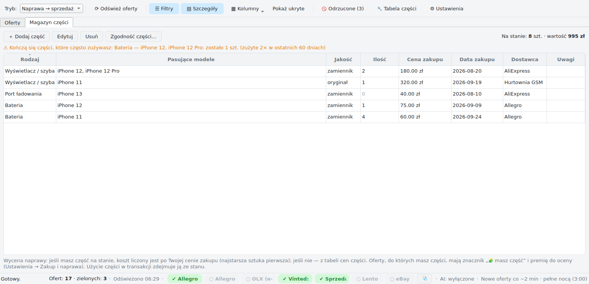

- **Wycena naprawy:** jeśli masz pasującą część, koszt naprawy liczony jest po **Twojej cenie zakupu**
  (najstarsza sztuka pierwsza — FIFO) i bez kosztu wysyłki części. Jeśli nie masz — z „Tabeli części”, jak dotąd.
- **Zgodność części:** przycisk „Zgodność części…” otwiera edytowalną tabelę grup modeli ze wspólną częścią
  (np. ekran iPhone XR = iPhone 11). Domyślne grupy są orientacyjne — sprawdź u dostawcy.
- **Znacznik i premia:** oferty, do których masz wszystkie potrzebne części, mają w tabeli znacznik
  **„🧩 masz część”** i premię do oceny (domyślnie +10, **Ustawienia → Zakup i naprawa → Magazyn części**).
- **Filtr:** „🧩 tylko oferty, do których mam części” w panelu filtrów.
- **Zużycie:** użycie części w transakcji zdejmuje ją ze stanu (najstarsza partia pierwsza).
- **Niski stan:** gdy część zużywasz często (domyślnie 2× w 60 dni), a zostało jej 1 szt. lub mniej,
  nad tabelą pojawia się ostrzeżenie.

### Czas pracy i zysk na godzinę

Każda oferta ma policzony **czas pracy** i **zysk na godzinę** — nowe kolumny „Czas pracy” i „Zysk na godzinę”
w tabeli (sortowanie kliknięciem nagłówka albo gotowy zestaw „Najlepszy zysk na godzinę”).

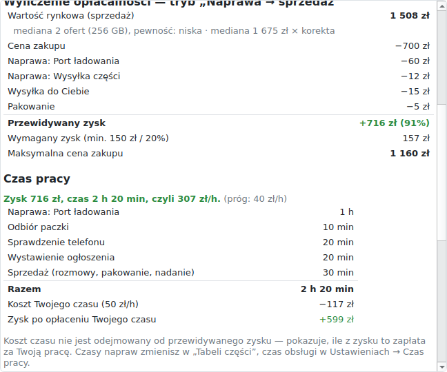

- **Czas naprawy:** każda pozycja „Tabeli cen części” ma kolumnę **„Czas pracy (min)”** (np. ekran 45 min,
  bateria 30 min, port 60 min, tylna szyba 90 min). Puste pole = czas domyślny dla rodzaju naprawy. Usterka
  o nieznanym zakresie (Face ID, zalanie, „nie włącza się”, „na części”) liczy się jako czas ryzyka
  (domyślnie 90 min).
- **Stały czas obsługi** przy każdym telefonie (**Ustawienia → Zakup i naprawa → Czas pracy**): odbiór paczki
  (10 min) albo dojazd po odbiór — liczony z odległości (tam i z powrotem, 50 km/h) plus spotkanie (15 min),
  sprawdzenie telefonu (20 min), wystawienie ogłoszenia (20 min), sprzedaż: rozmowy, pakowanie, nadanie (30 min).
- **Zysk na godzinę** = przewidywany zysk ÷ czas. W wyliczeniu widać to zdaniem, np.
  **„Zysk 150 zł, czas 3 h, czyli 50 zł/h”**, a pod nim rozbicie czasu na pozycje.
- **Stawka godzinowa** (domyślnie 50 zł/h): koszt Twojego czasu pokazywany **osobno** („Koszt Twojego czasu”
  i „Zysk po opłaceniu Twojego czasu”) — nie jest odejmowany od przewidywanego zysku.
- **Minimalny zysk na godzinę** (domyślnie 40 zł/h, 0 = bez progu): oferty poniżej progu dostają niższy
  werdykt. Maksymalna cena zakupu jest liczona tak, żeby zysk na godzinę sięgnął progu, więc KUPUJ może spaść
  na NEGOCJUJ (z ceną, przy której się opłaca) albo na ODPUŚĆ. W uzasadnieniu pojawia się np. „To poniżej progu
  60 zł/h — werdykt obniżony z KUPUJ na NEGOCJUJ.”
- Zysk na godzinę jest też w powiadomieniach Telegram i w szczegółach oferty na telefonie.
- Czasy napraw są korygowane z faktycznych czasów z Twoich transakcji (patrz „Transakcje i samodoskonalenie wyceny”).

### Transakcje i samodoskonalenie wyceny

Zakładka **„Transakcje”** to lista kupionych telefonów: model, pamięć, stan, usterki, portal, link, data i cena
zakupu, **części z magazynu** (po ich cenie zakupu — zdejmowane ze stanu), **inne koszty** (wysyłka, prowizje,
dojazd, części spoza magazynu), **faktyczny czas naprawy**, data wystawienia, data i cena sprzedaży, gdzie
sprzedałeś. Status: **kupiony → w naprawie → wystawiony → sprzedany** (po wpisaniu ceny i daty sprzedaży status
zmienia się sam).

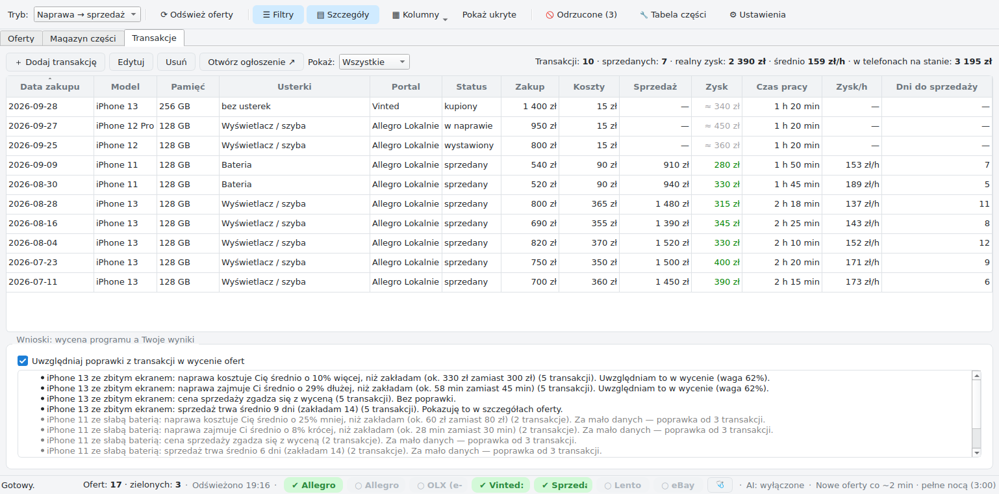

- **„🛒 Kupiłem”** w szczegółach oferty tworzy transakcję z danymi oferty i kosztami zakupu z wyceny,
  podpowiada części, które masz na stanie, i zapisuje **wycenę programu z chwili zakupu** (koszt naprawy, cena
  odsprzedaży, zysk, czas). Kupiona oferta ma w tabeli znacznik **„🛒 kupione”**, a przycisk zmienia się na
  „🛒 Transakcja” (otwiera zapisaną transakcję).
- **Realny zysk i zysk na godzinę** liczone po sprzedaży; do tego czas od wystawienia do sprzedaży. Nad tabelą:
  liczba transakcji, realny zysk łącznie, średni zysk na godzinę i pieniądze „zamrożone” w niesprzedanych
  telefonach. Kolumny sortują się liczbowo.
- Usunięcie transakcji: części wracają na stan albo zostają zużyte (do wyboru).

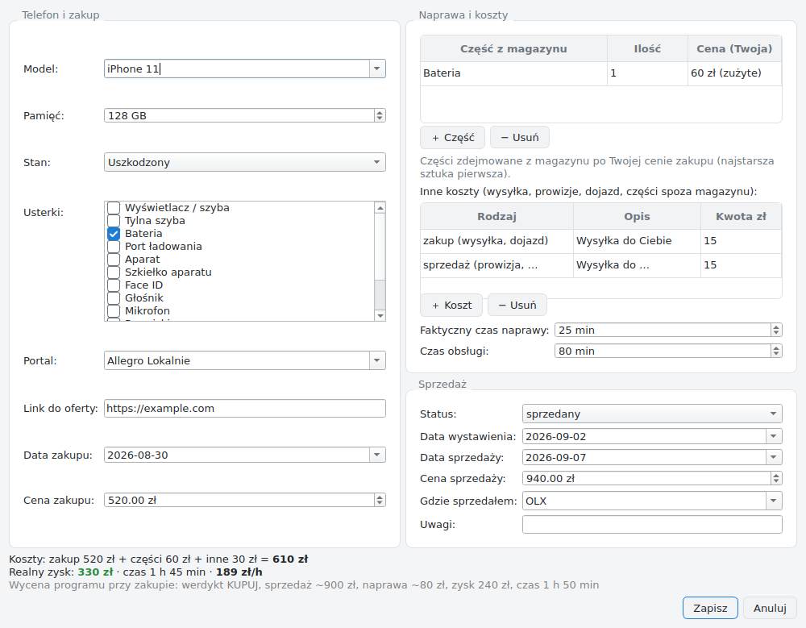

**Samodoskonalenie wyceny.** Program porównuje wycenę z chwili zakupu z faktycznym wynikiem — osobno dla
kombinacji **model + usterki** (np. „iPhone 12, zbity ekran”) — i liczy poprawki: **kosztu naprawy, czasu
naprawy, ceny odsprzedaży i czasu do sprzedaży**.

- Poprawka działa dopiero od **3 transakcji** danego typu i **stopniowo**: waga = n / (n + 3), czyli 50% przy
  3 transakcjach, 67% przy 6, 80% przy 12. Liczona jest **mediana** (jedna nietypowa transakcja jej nie
  przestawi), a poprawka jest przycięta do ±50%. Różnice poniżej 3% są uznawane za zgodne z wyceną.
- Poprawki uczą się względem wyceny **bez poprawek**, więc nie nakładają się same na siebie.
- **Wnioski zwykłym językiem** pod tabelą, np. „iPhone 12 ze zbitym ekranem: naprawa kosztuje Cię średnio
  o 18% więcej, niż zakładam (5 transakcji). Uwzględniam to w wycenie (waga 62%).”
- Przełącznik **„Uwzględniaj poprawki z transakcji w wycenie ofert”** (zakładka i Ustawienia → Zakup i naprawa).
  W szczegółach oferty, do której pasuje poprawka, widać listę zastosowanych poprawek i **podgląd wyceny z
  poprawkami i bez nich** (werdykt, zysk, maksymalna cena, koszt naprawy, czas, zysk na godzinę) — także gdy
  poprawki są wyłączone.
- Poprawiony czas naprawy trafia do kolumn „Czas pracy” i „Zysk na godzinę”; czas do sprzedaży pokazywany jest
  w szczegółach oferty (porównywany z czasem aktywności ogłoszeń modelu z zakładki „Rynek”, a bez danych — z 14 dniami).

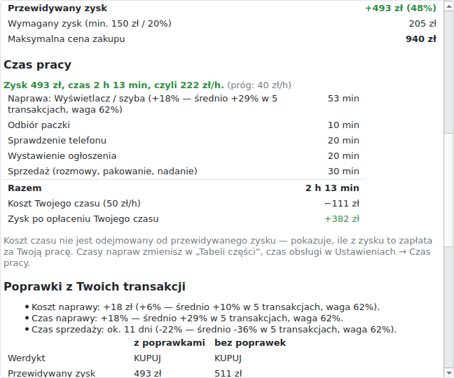

### Rynek: ceny w czasie, podaż, trend i najlepsze pory na zakupy

Zakładka **„Rynek”** pokazuje statystyki z ofert zebranych przez program (także archiwalnych). Wybierasz
**model, pamięć** (albo wszystkie) i **stan** (używane sprawne / uszkodzone / nowe) oraz zakres: **tydzień,
miesiąc albo 3 miesiące**.

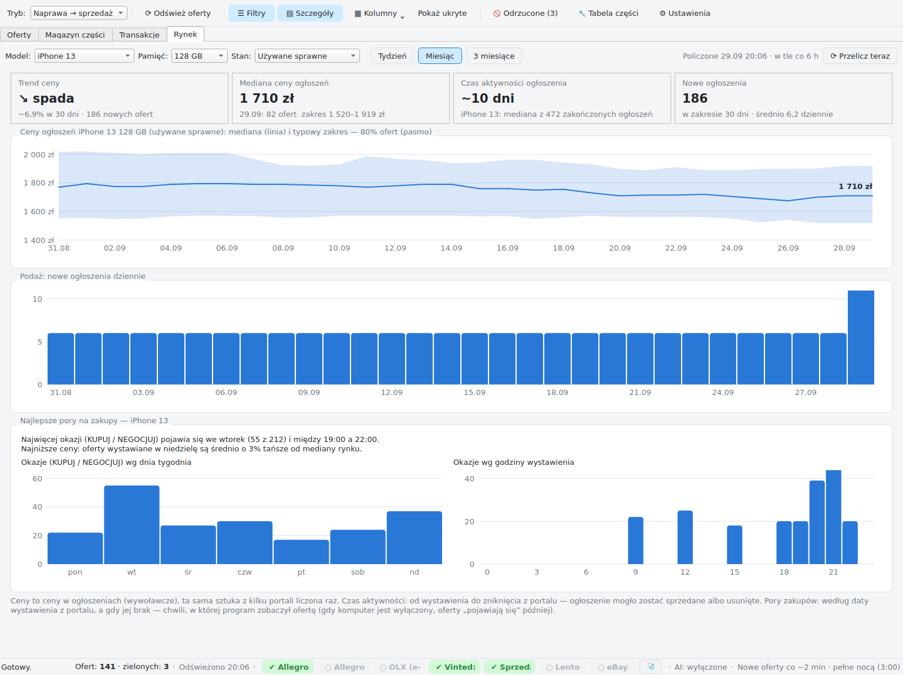

- **Ceny w czasie:** mediana cen ogłoszeń aktywnych danego dnia (linia) i typowy zakres — 80% ofert (pasmo).
  Najechanie myszą pokazuje dzień, medianę, zakres i liczbę ofert. Ta sama sztuka z kilku portali liczona raz.
- **Podaż:** liczba nowych ogłoszeń dziennie.
- **Czas aktywności ogłoszenia:** mediana czasu od wystawienia do zniknięcia z portalu, osobno dla modeli
  (przybliżona szybkość sprzedaży — zniknięte ogłoszenie mogło też zostać usunięte).
- **Najlepsze pory na zakupy:** kiedy pojawia się najwięcej ofert z werdyktem KUPUJ lub NEGOCJUJ (dni tygodnia
  i godziny, według werdyktu z chwili pojawienia się oferty) i w które dni ceny nowych ofert są najniższe
  względem mediany rynku.
- **Trend** (rośnie / stabilny / spada): prosta dopasowana do cen nowych ogłoszeń z ostatnich 30 dni. „Rośnie”
  albo „spada” tylko przy zmianie co najmniej 3% i wyraźnie większej od przypadkowych wahań — inaczej
  „stabilny”. Trend i czas aktywności widać też w szczegółach oferty (w wyliczeniu, pod wartością rynkową).
- **„Za mało danych”** zamiast wykresu, gdy danych jest za mało (progi w Ustawienia → Rynek).
- Statystyki liczą się **w tle co 6 godzin** (albo przyciskiem „⟳ Przelicz teraz”) i są zapisywane w bazie,
  więc przełączanie modeli i zakresów jest natychmiastowe. Dni starsze niż 3 tygodnie są zapisane na stałe —
  wykres 3 miesięcy nie znika, gdy dawne oferty zostaną usunięte z bazy. Nieaktywne oferty są trzymane
  co najmniej 97 dni.
- Czas aktywności ogłoszeń modelu jest też punktem odniesienia dla czasu sprzedaży w „Transakcjach”.

### Listy „Wszystkie oferty” i „Wybrane”

Nad tabelą są dwie zakładki z licznikami, np. **„Wszystkie oferty (16)” · „Wybrane (4)”**. Liczniki
pokazują oferty widoczne po filtrach.

- **Automatycznie** do „Wybrane” trafiają oferty spełniające kryteria z **Ustawienia → Wybrane**:
  werdykty (domyślnie KUPUJ i NEGOCJUJ), minimalny zysk (domyślnie 150 zł), minimalna ocena
  (domyślnie bez progu) i brak poważnej flagi (iCloud, IMEI, podróbka).
- **Ręcznie:** „✓ Dodaj do Wybranych” (albo ★ Obserwuj — to to samo) i „✕ Usuń z Wybranych”
  (panel szczegółów, prawy przycisk na ofercie). Ręczna decyzja ma pierwszeństwo przed kryteriami:
  usunięta oferta nie wróci automatycznie, dopóki znów jej nie dodasz.
- **Nieaktualne:** oferta z „Wybrane”, która zniknęła z portalu (niewidziana od „Ukryj oferty
  niewidziane od” — domyślnie 7 dni), nie znika z listy — jest wyszarzona i oznaczona **⌛**,
  a w szczegółach widać, kiedy była ostatnio widziana. We „Wszystkie oferty” jej nie ma.
- Filtry są wspólne dla obu list; **każda lista pamięta własne sortowanie**, a program pamięta też
  ostatnio otwartą listę.

### Okno główne

Układ: **filtry po lewej, tabela ofert w środku, szczegóły zaznaczonej oferty po prawej**,
pasek statusu na dole. Panele włączasz i wyłączasz przyciskami „☰ Filtry” (Ctrl+F)
i „▤ Szczegóły” (Ctrl+D). Ich szerokość zmienisz, przeciągając krawędź. Układ jest zapamiętywany.

- **Kolumny domyślne:** model, pamięć, cena, szacowany zysk, max cena zakupu, werdykt, portal.
  Pozostałe (zdjęcie, stan, bateria, wartość rynkowa, ocena, czerwone flagi, lokalizacja, data dodania,
  link) włączasz w menu **„▦ Kolumny”** albo prawym przyciskiem na nagłówku. Kolumny można przeciągać
  i poszerzać; „Przywróć domyślne kolumny” cofa zmiany. Nagłówek jest zawsze widoczny przy przewijaniu.
- **Sortowanie** (pasek „Sortuj:” nad tabelą albo nagłówki kolumn):
  - do trzech poziomów, np. „Werdykt, potem Zysk”: drugi poziom rozstrzyga remisy pierwszego;
  - przycisk obok pola (np. „↓ największy” / „↑ najmniejszy”) odwraca kierunek jednym kliknięciem;
  - klik w nagłówek sortuje po tej kolumnie, drugi klik odwraca kierunek; **Shift+klik** dodaje kolumnę
    jako kolejny poziom (w nagłówku widać numer poziomu i kierunek, np. „Pamięć ²↓”);
  - **Model** sortuje się w kolejności generacji (… 11, 11 Pro, 11 Pro Max, SE 2020, 12 mini, 12, 12 Pro,
    12 Pro Max, 13 mini, 13 …), a w ramach modelu po pamięci;
  - „Gotowe ▾” — gotowe zestawy (najlepsze okazje, największy zysk, najtańsze, model i pamięć, najnowsze);
  - oferty bez wartości (np. bez wyliczonego zysku) są zawsze na końcu;
  - domyślnie: werdykt (najlepszy najpierw), potem zysk malejąco; ostatnie sortowanie jest zapamiętywane
    między uruchomieniami. Sortowanie nie wycenia ofert od nowa — działa natychmiast.
- **Werdykt** to kolorowa etykieta z tekstem: 🟢 KUPUJ, 🟡 NEGOCJUJ, ⚪ DO WERYFIKACJI, 🔴 ODPUŚĆ.
  Ocena 0–100 jest w podpowiedzi i w kolumnie „Ocena”. Tło wierszy jest neutralne,
  a oferty obserwowane są lekko wyróżnione.
- Ceny mają format „1 250 zł” i są wyrównane do prawej. **Zysk dodatni jest zielony, ujemny czerwony.**
- Oznaczenia przy modelu:
  - **⚑N** — liczba czerwonych flag; najedź myszą, aby zobaczyć listę. Przy poważnej fladze
    (iCloud, IMEI, MDM, podróbka) nazwa modelu jest czerwona;
  - **★** — oferta obserwowana.
- **Panel szczegółów** pokazuje zaznaczoną ofertę od razu po kliknięciu:
  - zdjęcia,
  - werdykt z uzasadnieniem,
  - rekomendację negocjacji (cena otwierająca i maksymalna),
  - pełne wyliczenie: wartość rynkową i jej źródło, każdą pozycję kosztów, zysk, wymagany zysk i max cenę,
  - czerwone flagi z karą punktową,
  - dane rozpoznane z ogłoszenia, historię ceny i opis.

  Przyciski: „↗ Otwórz”, „★ Obserwuj”, „Ukryj”. **Podwójne kliknięcie**, Enter albo „⤢”
  otwiera to samo w dużym oknie.
- **Pasek statusu** (na dole): liczba ofert (widoczne po filtrach / wszystkie, w tym zielone),
  godzina ostatniego odświeżenia, status każdego portalu (najedź myszą, aby zobaczyć błąd i podpowiedź),
  przycisk diagnostyki 🩺 i czas następnego automatycznego odświeżenia.
- **Motyw jasny / ciemny / systemowy** i rozmiar czcionki ustawisz w
  „⚙ Ustawienia → Ogólne i pobieranie → Wygląd”. Zmiana działa od razu, bez restartu.
- Kliknięcie „Otwórz ↗” w kolumnie „Link” od razu otwiera ogłoszenie w przeglądarce.

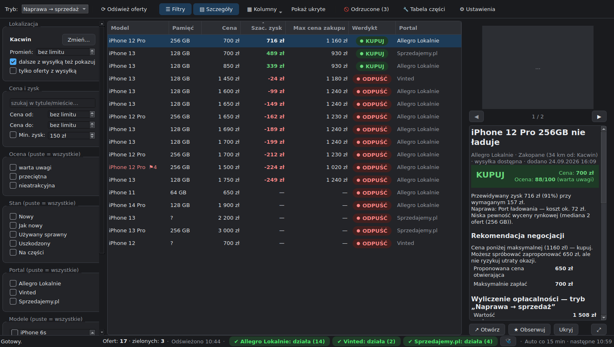

- **Prawy przycisk myszy** na wierszu otwiera menu: szczegóły, otwórz, obserwuj, ukryj.
  Ukryte oferty znikają z listy. Przycisk „Pokaż ukryte” pozwala je przywrócić.
- Przełącznik trybu (Naprawa → sprzedaż / Szybki resell) od razu przelicza wyceny.
- Pobieranie działa w osobnym wątku, więc okno nie zawiesza się w trakcie.
  Błąd portalu widać w pasku statusu; szczegóły są w podpowiedzi po najechaniu myszą
  i w logu `%LOCALAPPDATA%\PhoneBot\logs\phonebot.log`.
- **Panel filtrów** po lewej działa natychmiast, bez ponownego pobierania ofert,
  i zapamiętuje ustawienia. Możesz filtrować po:
  - lokalizacji i promieniu (oferty z wysyłką mogą zostać mimo odległości),
  - „tylko z wysyłką”,
  - tekście,
  - cenie od–do,
  - minimalnym zysku,
  - ocenie (zielone / żółte / czerwone),
  - stanie,
  - portalu,
  - modelach.
- **⚙ Ustawienia**: wszystkie progi i koszty, edytowalne bez zmian w kodzie:
  - portale i tempo pobierania,
  - minimalny zysk dla każdego trybu,
  - kanały sprzedaży i prowizje,
  - koszty zakupu i naprawy,
  - opłaty kupującego (np. ochrona kupujących na Vinted),
  - parametry wyceny rynkowej i ręczne wartości rynkowe,
  - progi werdyktu i kolorów,
  - kary za flagi.
- **🔧 Tabela części**: ceny części dla każdego modelu (wiersz „*” to cena domyślna),
  z filtrem po modelu. Możesz dodawać i usuwać pozycje.
- Pobierane są frazy „iphone”, w trybie naprawy dodatkowo „iphone uszkodzony / zbity / na części”,
  oraz frazy dopisane w ustawieniach. Z każdej frazy pobierane są maksymalnie 3 strony wyników. Aplikacja pomija:
  - akcesoria i pojedyncze części (etui, szkła, wyświetlacze…),
  - ogłoszenia „kupię / skup / zamienię”,
  - oferty z nierozpoznanym modelem

  (szczegóły w sekcji „Filtr ogłoszeń i »Odrzucone«”).
- Ceny wszystkich zebranych ofert zasilają bazę do liczenia wartości rynkowej.
  Im dłużej aplikacja działa, tym dokładniejsze są wyceny.

Gotowy plik `PhoneBot.exe` (bez instalowania Pythona) pojawi się w etapie 5.

Dane aplikacji (baza SQLite, logi, miniatury) trafiają do `%LOCALAPPDATA%\PhoneBot`.
Inne miejsce ustawisz zmienną środowiskową `PHONEBOT_HOME`.

## Jak działa wycena

Każde ogłoszenie przechodzi przez następujące kroki:

1. **Normalizacja** (`core/normalizer.py`): z tytułu, opisu i parametrów portalu
   wyciągane są model, pojemność, stan, kondycja baterii, gotowość do negocjacji
   i lista usterek. Rozpoznawanie uwzględnia zaprzeczenia: „ekran nie zbity” czy
   „bez blokad iCloud” nie są traktowane jak usterki ani flagi.
2. **Czerwone flagi** (`core/red_flags.py`): blokada iCloud, zablokowany IMEI,
   MDM, podróbka, simlock, brak zasięgu, zamienniki, „na części” bez opisu,
   brak zdjęć, podejrzanie niska cena i nieznany koszt naprawy. Flagi obniżają
   ocenę (kary można edytować), ale domyślnie nie zmieniają werdyktu.
3. **Wartość rynkowa V** (`core/market.py`): mediana cen porównywalnych ofert
   (ten sam model, pojemność i klasa stanu) z ostatnich 30 dni, po odrzuceniu
   wartości odstających (IQR). Wynik jest mnożony przez korektę 0,90, bo ceny
   wywoławcze są wyższe od transakcyjnych. Gdy danych brakuje, stosowana jest
   kolejno: mediana z mniejszej próby, mediana innych pojemności (przeliczona)
   albo wartość wpisana ręcznie w ustawieniach.
4. **Koszty i zysk** (`core/valuation.py`):
   - naprawa R = części z edytowalnej tabeli + wysyłka części + własna robocizna
     (usterka o nieznanym koszcie, np. „nie włącza się”, liczy się jako ryzyko 200 zł),
   - dostarczenie Sb = wysyłka albo dojazd (odległość × 2 × stawka za km),
   - sprzedaż Cs = prowizja wybranego kanału + opłata stała + wysyłka + pakowanie,
   - **zysk = V − cena − R − Sb − Cs**.
5. **Maksymalna cena zakupu** to najwyższa cena, przy której zysk jest nie
   mniejszy niż wymagany: kwota (np. 150 zł) i/lub procent od zainwestowanej
   kwoty (np. 20%). Tryb łączenia tych progów ustawisz w opcjach.
   Dochodzi do tego próg **minimalnego zysku na godzinę** (`core/work_time.py`): zysk musi też
   wynosić co najmniej próg × czas pracy (naprawa z tabeli części + stały czas obsługi).
6. **Werdykt i negocjacje** (`core/negotiation.py`):
   - **KUPUJ**: cena ≤ max. Dostajesz sugestię delikatnej propozycji niższej ceny.
   - **NEGOCJUJ**: cena do 15% powyżej max (do 25%, gdy w ogłoszeniu jest
     „do negocjacji”). Dostajesz cenę otwierającą i maksymalną.
   - **ODPUŚĆ**: w pozostałych przypadkach, a także przy „cenie ostatecznej” powyżej max.
7. **Ocena 0–100 i kolor**: ocena uwzględnia atrakcyjność ceny, pewność
   wyceny rynkowej i kary za flagi. Kolor zielony oznacza ≥ 65 pkt, żółty ≥ 40 pkt,
   czerwony poniżej 40 pkt.

W trybie **„Szybki resell”** telefony z usterkami wymagającymi naprawy dostają
ODPUŚĆ. Słaba bateria i drobne wgniecenia nie dyskwalifikują oferty.

### Wartości domyślne do weryfikacji

Ceny części (`core/parts.py`) i prowizje portali (`core/settings.py`) to
**wartości orientacyjne**. Po uruchomieniu GUI można je edytować w aplikacji.
Sprawdź zwłaszcza:

- ceny części u swojego dostawcy i czasy napraw według własnej wprawy,
- aktualny cennik OLX, jeśli tam sprzedajesz (opłaty za ogłoszenia w kategorii Telefony),
- prowizję Allegro dla smartfonów (domyślnie 8% + 1 zł).

## Struktura projektu

```
phonebot/
  core/          logika domenowa (bez GUI i sieci) — w pełni testowana
    models.py        modele: oferta, stan, usterki, flagi, wynik wyceny
    text.py          normalizacja tekstu i dopasowanie fraz z zaprzeczeniami
    catalog.py       katalog modeli iPhone i pojemności
    normalizer.py    model / pojemność / stan / usterki / bateria / negocjacje
    red_flags.py     czerwone flagi
    market.py        wartość rynkowa (mediana, IQR, fallbacki)
    parts.py         domyślna tabela cen części (z czasem pracy przy naprawie)
    inventory.py     magazyn części: partie, zgodność modeli, FIFO, niski stan
    work_time.py     czas pracy (naprawa + obsługa), zysk na godzinę i próg
    transactions.py  transakcje, realny zysk, poprawki wyceny (model + usterki) i wnioski
    market_stats.py  statystyki rynku: ceny dzienne, podaż, trend, czas aktywności, najlepsze pory
    valuation.py     koszty, zysk, max cena zakupu
    negotiation.py   werdykt, negocjacje, ocena i kolor
    settings.py      wszystkie ustawienia (JSON w bazie)
    geo.py           odległości
  storage/       SQLite: schemat z migracjami, repozytoria
  core/listing_filter.py  wieloetapowy filtr: akcesoria, części, „kupię”, kilka generacji, test ceny
  core/sanity.py  zabezpieczenia werdyktu (DO WERYFIKACJI, limity przy flagach)
  core/language.py  rozpoznawanie języka tytułu (oferty z zagranicy na Vinted)
  services/offer_guard.py  reguły odrzucania w jednym miejscu (kraj, sprzedawcy seryjni, ponowne filtrowanie)
  ml/            lokalne AI: seed_data.py (zbiór startowy), text_model.py (klasyfikator tytułów),
                 photo_model.py (CLIP w onnxruntime), ollama.py (klient Ollamy), desc_model.py (czytanie
                 opisów + sprawdzanie odpowiedzi), combine.py (łączenie warstw), selftest.py
  core/messages.py  szablony wiadomości do sprzedającego;  sources/pages.py  opis ze strony oferty
  services/ai_service.py  dane do nauki z bazy, douczanie, analiza zdjęć;  ui/ai_worker.py  wątek AI
  net/http.py    klient HTTP: limit zapytań na host, ponawianie (tenacity), cache odpowiedzi
  services/      evaluator.py (baza + wycena), scanner.py (równoległe pobieranie z izolacją błędów),
                 post_scan.py (powiadomienia po skanie),
                 notifications.py (Telegram), telegram_queue.py (kolejka, cisza, limity),
                 notify_service.py (podgląd i test profilu), telegram_bot.py (komendy /pauza /profile…)
  core/notify_profiles.py  profile powiadomień: filtry, dopasowanie, opis;  web/notify.py  profile na telefonie
  core/view_filter.py  filtry widoku;  core/places.py  wbudowana lista miejscowości
  net/geocode.py wyszukiwanie miejscowości (OpenStreetMap Nominatim)
  sources/       adaptery portali: base.py (interfejs), allegro_lokalnie.py, vinted.py, sprzedajemy.py,
                 extract.py (odporne wyciąganie ofert z JSON osadzonego w stronach)
  ui/            GUI PySide6: main_window.py, table_model.py, offer_details.py (+ details_html.py),
                 images.py (miniatury), workers.py (wątek), theme.py (kolory), filters_panel.py,
                 settings_dialog.py, parts_editor.py, location_dialog.py, inventory_tab.py (magazyn),
                 transactions_tab.py (transakcje), market_tab.py + charts.py (rynek, wykresy),
                 notify_profiles_ui.py (profile powiadomień z podglądem)
tests/           testy jednostkowe (+ fixtures z przykładowymi odpowiedziami portali)
tools/           screenshot.py — zrzut okna na danych testowych
scripts/         clip_prepare.py (wektory opisów klas CLIP), clip_check_app.py (test analizy zdjęć na
                 prawdziwym modelu) — uruchamiane w GitHub Actions
phonebot.spec    konfiguracja PyInstaller (PhoneBot.exe); run_phonebot.py — punkt wejścia
assets/          ikona aplikacji
```

Aby dodać kolejny portal, utwórz plik w `sources/` z klasą dziedziczącą po
`SourceAdapter` (metoda `search`) i oznacz ją dekoratorem `@register`.
Awaria jednego adaptera jest izolowana i nie zatrzymuje pozostałych.

## Plan etapów

1. ✅ Architektura, baza danych i logika wyceny z testami.
2. ✅ Pierwszy adapter i podstawowa tabela ofert w GUI (adapter OLX później usunięty, patrz niżej).
3. ✅ Kolorowanie, werdykty i rekomendacje negocjacji w GUI (okno szczegółów).
4. ✅ Allegro Lokalnie i Vinted, filtry, tryby, okno ustawień, wybór miejscowości i edytor tabeli części.
5. ✅ Automatyczne odświeżanie, zasobnik systemowy, powiadomienia Windows i Telegram oraz gotowy plik
   `PhoneBot.exe` budowany automatycznie przez GitHub Actions (płatna analiza opisów przez Claude — usunięta
   w wersji 1.4, zastąpiona lokalnym modelem).
6. ✅ Wieloetapowy filtr akcesoriów z widokiem „Odrzucone”, nowy układ okna (filtry | tabela | szczegóły),
   motyw jasny/ciemny i optymalizacja wydajności.
7. ✅ Zabezpieczenia regułowe: werdykt DO WERYFIKACJI, testy sensowności ceny i zysku, limity werdyktu
   przy flagach, kilka generacji w tytule, słowa w językach sąsiednich, kraj ofert Vinted, sprzedawcy
   seryjni, kategorie portali po ID, czysta wycena rynkowa.
8. ✅ Darmowe lokalne AI: klasyfikator tytułów (scikit-learn) z douczaniem na Twoich oznaczeniach,
   analiza zdjęć (CLIP), łączenie warstw z werdyktem, przycisk „To nie jest telefon”.
9. ✅ Opcjonalny lokalny model językowy (Ollama, qwen3:8b) czyta opisy ofert „DO WERYFIKACJI”
   (z opisem ze strony oferty, gdy wyniki go nie mają) oraz szablony wiadomości z przyciskiem
   „Skopiuj wiadomość”.

### Wydajność

Okno pokazuje się od razu, a oferty wczytują się chwilę później (napis „Wczytywanie ofert…” na pasku stanu).
Ocena ryzyka oszustwa korzysta z kontekstu z bazy zapamiętanego między odświeżeniami. Kontekst liczy się
od nowa tylko wtedy, gdy zmienią się oferty, zdjęcia albo dane sprzedających. Sygnały z tekstu ogłoszenia
liczone są raz na treść. Sprzedawcy seryjni sprawdzani są jednym zapytaniem do bazy zamiast jednym na sprzedawcę.

Pomiar na 3000 aktywnych ofert (`python tools/benchmark.py --offers 3000`, mediana z 3 przebiegów,
wersja 1.11.0 → 1.12.0):

| Operacja | Przed | Po |
|---|---|---|
| Widoczne okno (typowy start) | 1,08 s | 0,33 s |
| Widoczne okno (pierwszy start po aktualizacji) | 1,63 s | 0,37 s |
| Pełne wczytanie listy przy starcie | 1,20 s | 1,05 s |
| Odświeżenie listy (np. po skanie) | 726 ms | 348 ms |
| Działania po skanie (zdjęcia, ceny, lista) | 218 ms | 182 ms |
| Sortowanie / filtr / przełączenie list | 0 / 39 / 82 ms | 0 / 39 / 76 ms |
| Przewijanie tabeli (średnio na klatkę) | 16 ms | 15 ms |
| Pamięć | 152 MB | 154 MB |

Sortowanie, filtr i przewijanie były już szybkie. Ich czas zależy głównie od rysowania w Qt, więc różnice
mieszczą się w szumie pomiaru. Wyniki wyceny się nie zmieniły: na tej samej bazie 3000 ofert werdykt, zysk,
ocena i ryzyko są identyczne przed optymalizacją i po niej.

Baza nie rośnie bez końca: oferty nieaktywne dłużej niż 2 × okno wyceny (min. 60 dni) są usuwane,
z wyjątkiem obserwowanych. Nieużywane od 30 dni miniatury znikają z dysku, a zdjęcia w pamięci
mają limit.

## Uwaga o źródłach danych

Allegro Lokalnie nie ma API dla ogłoszeń, więc adapter czyta dane osadzone w stronie wyników
(JSON / JSON-LD). Wyszukuje w nich obiekty wyglądające jak oferta, zamiast polegać na sztywnej
ścieżce, dlatego drobne zmiany serwisu go nie psują. Jeśli serwis całkowicie zmieni wygląd,
aplikacja zgłosi błąd źródła („możliwa zmiana formatu serwisu”).
Allegro Lokalnie podaje tylko nazwę miasta. Odległość jest liczona, gdy to miasto jest
na wbudowanej liście miejscowości.

**OLX: tylko z powiadomień e-mail.** OLX blokuje automatyczne pobieranie: zapora CloudFront odpowiada
„403 Request blocked” na API, stronę wyników, a nawet robots.txt. Sprawdzone we wrześniu 2026 z serwerów
GitHuba i z łącza domowego. Oficjalne Partner API OLX służy tylko do zarządzania własnymi ogłoszeniami.
Dlatego PhoneBot nie pobiera stron OLX, tylko czyta maile z powiadomieniami (opis niżej, w części
„OLX z powiadomień e-mail”). Facebook Marketplace nie jest obsługiwany: nie ma publicznego API,
a regulamin Meta zabrania automatycznego zbierania danych. OLX pozostaje też **kanałem sprzedaży**
w ustawieniach zysku.

Vinted działa w trybie „best effort”. We wrześniu 2026 Vinted przeniósł katalog na
`api.vinted.pl/svc-catalogue/items` (stary adres zwraca 404) i adapter korzysta już z nowego. Adapter pobiera anonimowy token sesji
(ciasteczko `access_token_web`) i wysyła go do endpointu katalogu. Vinted często blokuje automaty; wtedy pasek stanu
pokaże błąd, a pozostałe portale działają normalnie. Katalog Vinted nie zawiera opisów ofert,
więc usterki rozpoznawane są tylko z tytułu. Do kosztu zakupu doliczana jest opłata za ochronę
kupujących: dokładna, jeśli podaje ją Vinted, w przeciwnym razie z ustawień (domyślnie 5% + 2,90 zł,
wartość orientacyjna).

Sprzedajemy.pl nie ma API. Strona wyników zawiera listę ofert w standardowym formacie JSON-LD,
którą czyta ten sam uniwersalny ekstraktor co Allegro Lokalnie. Miasto jest odczytywane z adresu
ogłoszenia. Pobierana jest pierwsza strona wyników na frazę, a ceny filtruje sama aplikacja.

Adaptery Allegro Lokalnie i Vinted są przetestowane na przykładowych danych w `tests/fixtures/`.
Pierwsze uruchomienie na prawdziwych portalach może wymagać dopasowania.

Żaden z trzech portali nie udostępnia publicznego API do wyszukiwania cudzych ogłoszeń.
Adaptery będą korzystać z danych, które strony same ładują w przeglądarce. Każdy adapter:

- ma limit zapytań (domyślnie jedno zapytanie na 4 s na portal),
- korzysta z cache,
- przy błędach ponawia próby z rosnącym opóźnieniem.

Analiza zdjęć przez lokalne AI pobiera **jedno** (główne) zdjęcie oferty, tylko dla ofert z werdyktem innym
niż ODPUŚĆ, każde tylko raz i nie częściej niż co 1 s z jednego serwera — to te same zdjęcia, które program
pokazuje jako miniatury.

Strony pojedynczych ofert (opis dla lokalnego modelu językowego) pobierane są tylko przy włączonej analizie
opisów, tylko dla ofert DO WERYFIKACJI, każda raz i w tym samym limicie zapytań co wyszukiwanie.

Automatyczne pobieranie może naruszać regulaminy portali. Używaj aplikacji
na własną odpowiedzialność, wyłącznie do użytku osobistego i z umiarkowaną
częstotliwością odświeżania.
